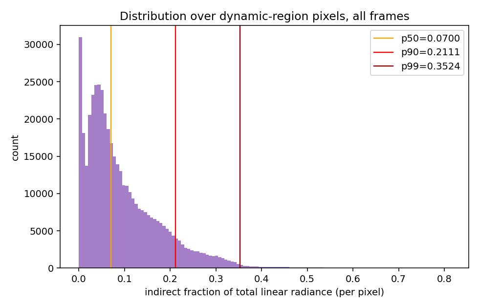
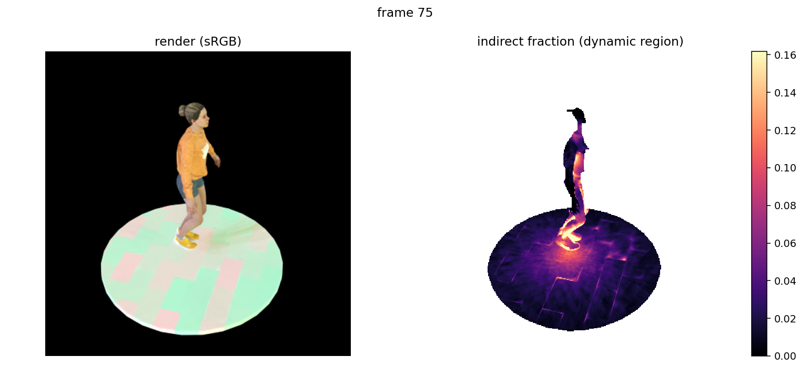
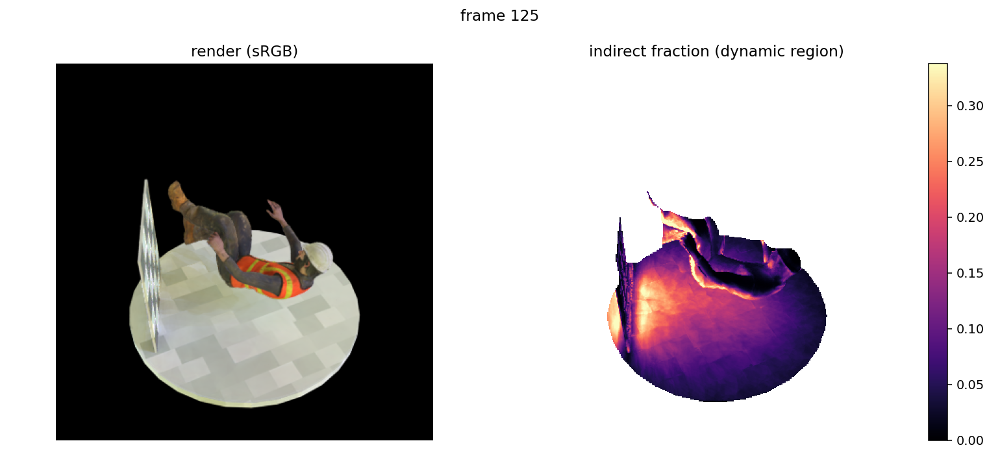
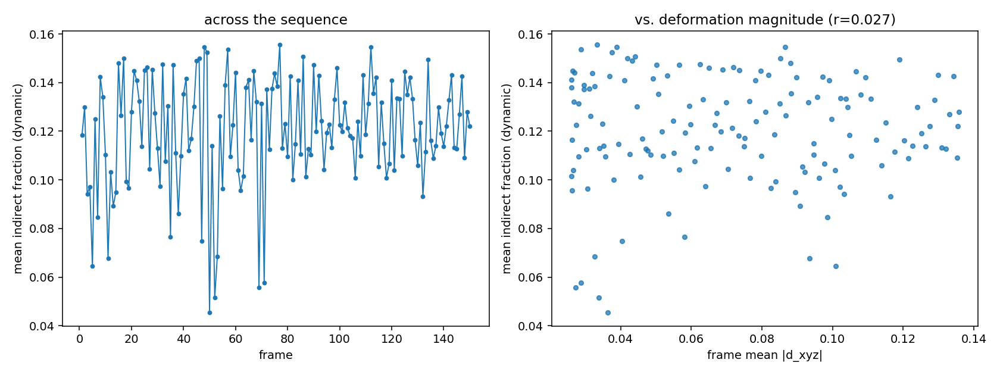
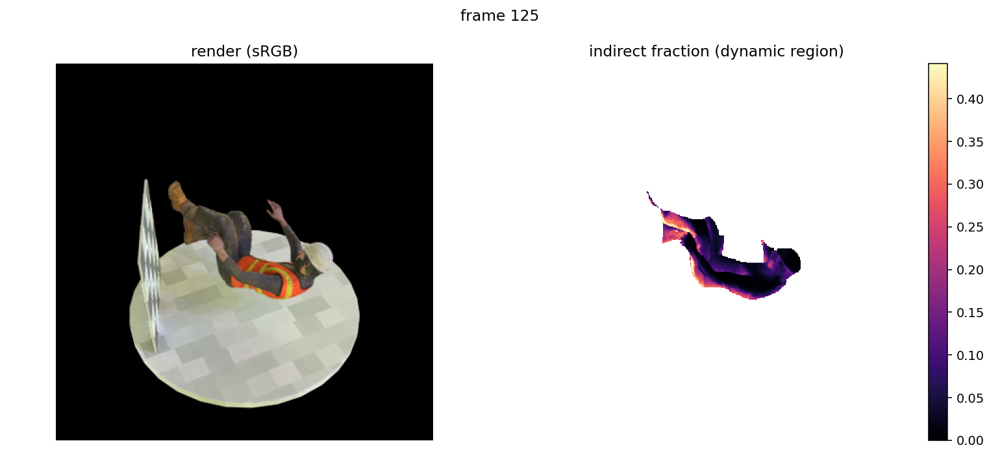

# Indirect-illumination fraction of rendered radiance

> ⚠️ **SUPERSEDED IN PART — read the [Correction](#correction-dynamic-mask-channel-bug-corrected-numbers)
> section at the bottom before using any number from this document.** The
> "dynamic-region" restriction used throughout the original run thresholded the
> **wrong channel** of the `dynamic_mask/` PNGs and was effectively a
> *foreground* restriction (floor + prop included), not a dynamic-only one. The
> corrected numbers are materially different in the tails — jumpingjacks p99
> roughly **doubles** (12.6% → 23.7%) — and one qualitative conclusion below
> ("even the worst-case tail combination stays below the floor", for
> jumpingjacks) **no longer holds**. The central finding (indirect is a small
> component; typical implied error is well under the noise floor) survives.

**Question.** Physics says correct diffuse irradiance should change 8–93% under the
normal rotations present in these scenes (`docs/irradiance_frequency_test.md`), and
`docs/test1_probe_c_reanalysis.md` confirms a real rotation-dependent error in the
frozen stored radiance. Yet LumiMotion's renders and relighting are good
(`docs/test1_probe_d*.md`). One untested explanation: **indirect illumination may
simply be a small fraction of total rendered radiance**, so even a large *relative*
error in it is negligible in the render. This measures that fraction.

**Answer, up front.** Indirect illumination is a **small** component of these
images — mean **2.8%** (jumpingjacks) and **9.6%** (standup) of total linear
radiance under the training light, median 2.1% / 7.0%. It is highly concentrated:
essentially all of it sits at body–floor contact points and concavities, with the
bulk of each image below 3%. Combining this with the measured rotation-dependent
error gives an implied render error of **0.12–0.45%** for jumpingjacks and
**0.9–4.9%** for standup — against a measured overall render-vs-GT error (Probe D)
of 2.4–5.4% and 5.5–13.2% respectively.

**So: for jumpingjacks the answer is a clean "no, it cannot matter" — the implied
error is 6–36× below the reconstruction noise floor, and even the worst-case tail
combination stays below it. For standup the answer is "mostly no, but not
dismissibly so" — typical implied error is 1.4–6× below the noise floor, but in the
high-indirect tail (p90–p99 indirect fraction at p99 rotation) it reaches 8.7–14.4%
against a 5.5% floor, i.e. it exceeds it.** This is a genuine scene-dependent
split, not a uniform null, and it is discussed rather than averaged away below.

---

## Why this required re-rendering

`scripts_local/render_trajectory.py`'s dumps are all still on disk (150 frames ×
2 scenes × 2 lighting conditions, all present and checked first). **They do not
contain the needed quantity.** They store `lind_linear` =
`local_incident_lights.mean(dim=1)` — the raw mean *incident* indirect radiance.
The contribution to final radiance is

```
mean_s[ f · L_local(s) · incident_areas(s) · cos(s) ]        (render_ir.py:538-540)
```

weighted by BRDF, solid angle, and cosine — none of which were saved. The
contribution is therefore not recoverable from the dumps, and a second render pass
was required. Stating this plainly as instructed.

## Method — exact linear split, not an approximation

`render_ir.py:538-540` computes `transport = incident_lights * incident_areas *
n_d_i`, then `diffuse = (f_d * transport).mean(-2)` and `specular = (f_s *
transport).mean(-2)`. `f_d`, `f_s`, `incident_areas` and `n_d_i` are all
independent of `incident_lights`, so **`diffuse + specular` is exactly linear** in
`incident_lights = incident_visibility·global + local`.

The existing `pipe.wo_indirect` ablation (`render_ir.py:527-528`) zeroes *only* the
local term, and does so **after** `pc.trace()` — so visibility, traced geometry and
sample directions are bit-identical between passes (`training=False` ⇒
`sample_incident_rays` uses `random_rotate=False`, i.e. deterministic directions).
Therefore

```
indirect_contribution = full_render_linear − wo_indirect_render_linear
```

holds **exactly**, not approximately. The same argument holds for the relight path
via `pipe.wo_indirect_relight` (`render_ir.py:504-507`).

The subtraction is done on **linear** diffuse/specular images. The pre-existing
`"diffuse"`/`"specular"` result keys are sRGB-encoded *and clipped to [0,1]* by
`rgb_to_srgb()`, so they cannot recover linear radiance for bright pixels; a small
additive `dump_linear_components` hook was added to `render_ir.py` (default off,
outputs bit-for-bit unchanged when unset), matching the established
`dump_light_indirect` pattern on this branch.

**Validated before the full run**: on a test frame, indirect ≥ 0 everywhere and
indirect ≤ total everywhere — both physically necessary and both hold exactly.

Masking: eroded (5px) alpha ∩ `dynamic_mask/`, matching
`docs/test1_probe_d_relight.md`. Per-pixel radiance is channel-mean linear.
Fraction = indirect / total. 150 frames × 2 scenes × 2 lighting conditions.

---

## Results — the distribution

Pooled over dynamic-region pixels, all 150 frames (n = 450,000 sampled pixels per
condition):

| scene / light | mean | median | p90 | p99 | max |
|---|---|---|---|---|---|
| jumpingjacks, chapel_day (train light) | **2.79%** | 2.11% | 5.17% | 12.6% | 74.6% |
| jumpingjacks, golden_bay (relit) | **3.38%** | 2.67% | 6.04% | 15.2% | 76.9% |
| standup, chapel_day (train light) | **9.56%** | 7.00% | 21.1% | 35.2% | 81.3% |
| standup, golden_bay (relit) | **12.03%** | 8.01% | 30.3% | 47.1% | 94.1% |

Foreground-only (without the dynamic-mask restriction) is within 0.1 percentage
point of the dynamic-restricted numbers in every condition — the restriction
barely matters here. Train and test splits agree to within 0.5 pp throughout.



The distribution is strongly right-skewed in all four conditions: a large majority
of pixels sit at a few percent, with a thin tail reaching 70–94% in the deepest
contact shadows.

## Where it is highest




Exactly where physics predicts, which is a useful independent sanity check on the
split: the indirect fraction spikes at the **feet–floor contact** (jumpingjacks —
the bright halo around the shoes, ~16%, against ~2% over the rest of the body and
floor) and at **body–floor contact and the concavity under the torso and behind
the prop** (standup, ~30%+). Everywhere with an open view of the environment, it
is near zero. standup's much higher scene-level average is explained by its pose:
the figure lies on the platform for much of the sequence, putting a large part of
both body and floor in mutual contact.

## Variation across frames and with deformation



| condition | per-frame mean range | corr(mean frac, mean \|d_xyz\|) |
|---|---|---|
| jumpingjacks, chapel_day | 2.14% – 3.52% | −0.031 |
| jumpingjacks, golden_bay | 2.71% – 4.61% | −0.281 |
| standup, chapel_day | 5.38% – 12.62% | +0.017 |
| standup, golden_bay | 4.54% – 15.56% | +0.027 |

The indirect fraction varies meaningfully across the sequence (standup's more than
doubles as the figure lies down and stands up) but shows **essentially no
correlation with deformation magnitude** — it tracks *pose configuration* (what is
touching what), not *how far things moved from canonical*. That is the physically
expected behaviour and is worth noting because it means indirect fraction is not
an alternative explanation for any deformation-correlated signal.

---

## The key derived number: implied error contribution to the render

Relative error in the stored radiance is taken from
`docs/test1_probe_c_reanalysis.md` Check 1 (robust median-per-bin,
denominator-stable, dynamic Gaussians), interpolated to the three measured
rotation angles. Implied render error = (relative error in indirect radiance) ×
(indirect fraction of total radiance).

### jumpingjacks

| rotation | rel. error in stored radiance | implied render error @ mean frac | @ p90 frac | @ p99 frac |
|---|---|---|---|---|
| median (8.7°) | 4.3% | **0.12%** | 0.22% | 0.55% |
| p90 (49.6°) | 8.8% | **0.25%** | 0.46% | 1.11% |
| p99 (91.2°) | 13.4% | **0.37%** | 0.69% | 1.69% |

*Probe D measured overall render-vs-GT relative error (the noise floor this would
have to exceed to be detectable): **2.36%** (chapel_day), **5.43%** (golden_bay).*

### standup

| rotation | rel. error in stored radiance | implied render error @ mean frac | @ p90 frac | @ p99 frac |
|---|---|---|---|---|
| median (8.7°) | 9.4% | **0.89%** | 1.97% | 3.30% |
| p90 (49.6°) | 24.3% | **2.32%** | 5.12% | 8.55% |
| p99 (91.2°) | 41.0% | **3.92%** | 8.65% | 14.44% |

*Probe D measured overall render-vs-GT relative error: **5.46%** (chapel_day),
**13.24%** (golden_bay).*

### For intuition, in 8-bit terms

A relative change of 0.1% near a mid-tone linear value of 0.2 is **0.06/255**
sRGB levels; 0.5% is 0.29/255; 1% is 0.57/255. **The typical implied error for
jumpingjacks (0.12–0.45%) is well under half of one 8-bit quantization step** —
literally not representable in the rendered image. standup's typical implied error
(0.9–4.9%) reaches ~0.5–2.9/255 levels, which is representable but still small.

---

## Is this consistent with Probe D's null result?

**jumpingjacks: yes, decisively.** The implied error is 6–36× below the measured
reconstruction error, and even the worst-case combination in the table (p99
indirect fraction at p99 rotation, 1.69%) stays below the 2.36% floor. There is no
combination of the measured quantities that would make the frozen-transport error
detectable in this scene's renders. Probe D's null for jumpingjacks is fully
explained: **the indirect term is too small a component for an error in it to
matter.**

**standup: mostly, but with a real caveat.** Typical implied error (0.89–3.92%)
sits 1.4–6× below the 5.46% floor — consistent with a null. But in the
high-indirect tail, the implied error reaches **8.55–14.44%**, which *exceeds* the
overall reconstruction error. So for standup the honest statement is not "too
small to matter" but "**too small to matter across most of the image, and
plausibly detectable in the ~1–10% of pixels at contact points, where it would be
competing with — and likely buried by — the same magnitude of ordinary
reconstruction error**." This is notably the same scene where
`docs/test1_probe_c_reanalysis.md` found the stronger rotation-dependence (75% of
dynamic Gaussians positive vs. 61% for jumpingjacks) and where
`docs/test1_probe_d_relight.md` found its one positive deformation-scaling result.
Those three findings are mutually consistent: standup is the scene with enough
indirect light for the effect to be marginally visible, and it is the scene where
marginal traces of it appear.

**Overall reconciliation of the whole investigation.** All four results now fit
together without contradiction:
- Physics says the *relative* error in stored indirect radiance is large (8–93%) —
  `irradiance_frequency_test`. **True.**
- That error is really present in LumiMotion's per-Gaussian radiance —
  `probe_c_reanalysis`. **True.**
- The renders are nonetheless good — `probe_d`. **True, because** the indirect
  term is only 2.8–12% of total radiance, so a 4–41% relative error inside it
  becomes a 0.1–4% error in the render, at or below the level of ordinary
  reconstruction error.

The frozen-transport error is **real but small in its effect on these images**,
because the images have little indirect light in them. This is a statement about
*these benchmark scenes*, not about the method in general — see the first
limitation.

---

## Limitations

1. **This is a property of these scenes, not a general bound.** Both are a single
   figure on an open platform under distant lighting — geometrically about as
   favourable to direct illumination as a dynamic scene gets. A scene with strong
   interreflection (an interior, a figure in a corner or between walls, brightly
   coloured nearby surfaces producing colour bleeding) would have a far higher
   indirect fraction, and the same relative error would then matter proportionally
   more. **The 2.8–12% measured here should not be assumed to transfer.** That
   standup alone — merely by having the figure lie down against the floor — has
   3–4× jumpingjacks' indirect fraction shows how strongly this depends on
   configuration.
2. **The implied-error calculation is an upper bound**, in two ways that both make
   the true effect *smaller* than the numbers above:
   (i) it assumes the stored-radiance errors of all Gaussians a ray bundle hits
   are perfectly coherent, whereas averaging over 512 sample directions hitting
   many differently-oriented Gaussians will partially cancel them;
   (ii) it applies the *dynamic*-Gaussian rotation error to all traced hits,
   whereas rays that hit static Gaussians (76–78% of the population) pick up no
   rotation error at all.
   Being an upper bound strengthens the "negligible" conclusion for jumpingjacks
   and keeps standup's borderline case honest.
3. **The noise-floor comparison uses Probe D's overall render-vs-GT relative
   error as a proxy for detectability.** That quantity bundles every error source
   (geometry, albedo, roughness, envmap, deformation) and is not a formal
   detection threshold; it is used here as an order-of-magnitude reference for
   "what size of error is already present and would mask this one."
4. **Channel-mean scalarization** of both radiance quantities, consistent with
   prior probes but discarding colour — a colour-selective indirect error (likely,
   since indirect light carries the bouncing surface's colour) could be more
   visible than the scalar number suggests.
5. `spheres_v5_spec32` still has no trained checkpoint — same gap as every prior
   probe in this investigation.

---

# Correction: dynamic-mask channel bug, corrected numbers

Everything above this line was computed with a **broken dynamic-region
restriction**. This section reports the bug, its size, and the corrected
numbers. The corrected numbers are the ones to use.

## The bug

`docs/blend_files_survey.md` §"dynamic_mask RGB and Alpha channels are not the
same mask" established, by reading the Blender generation script itself, that in
`dynamic_mask/mask_XXXX.png`:

- **RGB** carries the dynamic/static segmentation (white = mesh driven by the
  character Armature, black = static floor/props).
- **Alpha** is just ordinary render alpha of any opaque object — the whole-scene
  foreground silhouette, carrying no dynamic/static information.

`analyse_probe_d.py`'s `load_dynamic_mask()` thresholded **Alpha**. So every
result labelled "dynamic-restricted" in this document — and in
`docs/test1_probe_d_relight.md` — was in fact **foreground-restricted**.

## (1) How much the two channels actually differ — measured

Confirmed directly from the mask files, all 150 frames per scene, at the same
`>127` threshold the code uses:

| scene | mean px, RGB>127 | mean px, Alpha>127 | area ratio RGB/Alpha | IoU(RGB, Alpha) |
|---|---|---|---|---|
| jumpingjacks | 29,675 | 158,225 | 0.187 (min 0.091, max 0.288) | **0.178** (min 0.091, max 0.268) |
| standup | 40,973 | 179,874 | 0.229 (min 0.037, max 0.414) | **0.222** (min 0.031, max 0.405) |

**The bug is not inconsequential — Alpha selects 4.4–5.3× more pixels than RGB,
and the two masks overlap at only IoU 0.18–0.22.**

Three further checks pin down the semantics exactly (frame 75, both scenes):

- `R == G == B` **exactly**; both channels are effectively binary (99.3–99.9% of
  pixels at <5 or >250).
- **Alpha vs. the beauty render's own alpha channel: IoU = 0.999.** Alpha is,
  to within antialiasing, literally the same silhouette the analysis already had
  from `rend_alpha` — intersecting with it was close to a no-op.
- RGB vs. beauty-render alpha: IoU = 0.166 (jumpingjacks) / 0.247 (standup) —
  i.e. RGB is a genuinely different, much smaller region: the character alone.

This also retro-explains a remark in the original text above: *"Foreground-only
(without the dynamic-mask restriction) is within 0.1 percentage point of the
dynamic-restricted numbers in every condition — the restriction barely matters
here."* It barely mattered because **it was the same mask**.

(A minor edge effect: 3–5% of RGB>127 pixels fall outside Alpha>127, at
antialiased silhouette edges where straight-alpha RGB stays saturated while
alpha falls off. These are removed anyway by the intersection with the eroded
beauty alpha.)

## (2) The fix

`load_dynamic_mask()` now takes `channel="rgb"` (correct, default) or
`channel="alpha"` (original buggy behaviour, retained so pre-fix numbers stay
reproducible), exposed as `--dynamic_mask_channel` on both
`analyse_probe_d.py` and `measure_indirect_fraction.py`. The docstring records
the channel semantics and their provenance so this cannot be re-derived wrongly
from pixel statistics again.

## (3) Corrected indirect-fraction table

Re-ran `measure_indirect_fraction.py` on all four conditions with
`--dynamic_mask_channel rgb`. Nothing else changed; no frame was dropped for
insufficient pixels. Old (alpha) vs corrected (rgb), pooled over the restricted
region across all 150 frames:

| scene / light | mask | px/frame | mean | median | p90 | p99 | max |
|---|---|---|---|---|---|---|---|
| jumpingjacks, chapel_day | alpha (old) | 33,434 | 2.79% | 2.11% | 5.17% | 12.62% | 74.6% |
| jumpingjacks, chapel_day | **rgb (new)** | 4,927 | **4.37%** | **2.86%** | **10.00%** | **23.66%** | 64.6% |
| jumpingjacks, golden_bay | alpha (old) | 33,434 | 3.38% | 2.67% | 6.04% | 15.23% | 76.9% |
| jumpingjacks, golden_bay | **rgb (new)** | 4,927 | **4.74%** | **2.68%** | **11.57%** | **29.23%** | 76.9% |
| standup, chapel_day | alpha (old) | 38,634 | 9.56% | 7.00% | 21.11% | 35.24% | 81.3% |
| standup, chapel_day | **rgb (new)** | 8,106 | **9.60%** | **4.88%** | **26.26%** | **50.81%** | 92.2% |
| standup, golden_bay | alpha (old) | 38,634 | 12.03% | 8.01% | 30.34% | 47.05% | 94.1% |
| standup, golden_bay | **rgb (new)** | 8,106 | **10.18%** | **5.76%** | **26.37%** | **58.29%** | 98.4% |

**Shape of the change.** The restricted region shrinks ~5×, and the
distribution gets *more extreme at both ends*: medians fall (standup 7.00% →
4.88%) while p90/p99 rise sharply (jumpingjacks p99 12.6% → 23.7%, standup p99
35.2% → 50.8%). Means move only modestly and not even consistently in sign
(jumpingjacks up ~55%, standup chapel flat, standup golden *down* 12.0% →
10.2%).

The mechanism is visible in the corrected spatial maps: the floor was
contributing a large mass of *moderate* indirect-fraction pixels that pulled the
distribution toward its middle. Restricted to the character alone, what remains
is a bimodal population — exposed body surfaces with very little indirect light,
plus an intense contact/self-occlusion band where the body meets the floor,
which is now a much larger *proportion* of a much smaller region.



Per-frame behaviour with the corrected mask (was: 2.1–3.5% / 5.4–12.6%):

| condition | per-frame mean range | corr(frac, mean\|d_xyz\|) | train / test |
|---|---|---|---|
| jumpingjacks, chapel_day | 1.84% – 8.56% | −0.229 | 4.38% / 4.25% |
| jumpingjacks, golden_bay | 2.27% – 11.49% | −0.150 | 4.69% / 5.24% |
| standup, chapel_day | 2.91% – 22.28% | −0.077 | 9.82% / 8.46% |
| standup, golden_bay | 3.33% – 26.66% | +0.132 | 10.18% / 9.87% |

Frame-to-frame variation is substantially wider than before (standup now spans
2.9%–22.3%), and the conclusion that indirect fraction tracks *pose
configuration* rather than *deformation magnitude* is unchanged — correlations
remain small and inconsistent in sign.

## Corrected implied render error — the load-bearing number

Recomputed exactly as in the original §"key derived number" (rotation-dependent
relative error from `docs/test1_probe_c_reanalysis.md` × indirect fraction),
only the fraction changed:

**jumpingjacks** (noise floor: chapel_day 2.36%, golden_bay 5.43%)

| rotation | rel. err | mean frac: old → **new** | p90 frac: old → **new** | p99 frac: old → **new** |
|---|---|---|---|---|
| median 8.7° | 4.3% | 0.12% → **0.19%** | 0.22% → **0.43%** | 0.55% → **1.02%** |
| p90 49.6° | 8.8% | 0.25% → **0.38%** | 0.46% → **0.88%** | 1.11% → **2.08%** |
| p99 91.2° | 13.4% | 0.37% → **0.58%** | 0.69% → **1.34%** | 1.69% → **3.16%** ⚠ |

**standup** (noise floor: chapel_day 5.46%, golden_bay 13.24%)

| rotation | rel. err | mean frac: old → **new** | p90 frac: old → **new** | p99 frac: old → **new** |
|---|---|---|---|---|
| median 8.7° | 9.4% | 0.89% → **0.90%** | 1.97% → **2.46%** | 3.30% → **4.75%** |
| p90 49.6° | 24.3% | 2.32% → **2.33%** | 5.12% → **6.37%** | 8.55% → **12.33%** ⚠ |
| p99 91.2° | 41.0% | 3.92% → **3.93%** | 8.65% → **10.76%** ⚠ | 14.44% → **20.83%** ⚠ |

(⚠ = exceeds that condition's noise floor. golden_bay columns omitted for
space; they follow the same pattern, jumpingjacks p99×p99 rising 2.03% → 3.90%
against a 5.43% floor — still below — and standup p99×p90 11.42% → 14.14%
against a 13.24% floor — now above.)

### What changes, and what doesn't

**Survives unchanged:** the central finding. Typical implied error — mean
indirect fraction at the median rotation — is **0.19%** (jumpingjacks) and
**0.90%** (standup), still 6–12× below the respective noise floors, and still
well under one 8-bit quantization step for jumpingjacks. Indirect illumination
is still a small component of these images, and a large relative error inside it
is still mostly invisible in the render. **The reconciliation of
`irradiance_frequency_test` / `probe_c_reanalysis` / `probe_d` still holds.**

**Changes, and it is a real change:** one stated conclusion above is now
**false**. The original text asserted for jumpingjacks that *"even the
worst-case tail combination stays below the floor"* — with the corrected mask,
p99-fraction × p99-rotation reaches **3.16% against a 2.36% floor**. jumpingjacks
therefore moves from the "clean no, it cannot matter" category into the same
"mostly no, but not dismissible in the tail" category standup was already in.
The two scenes no longer split qualitatively; they differ only in degree.

**Caveat on the tail numbers, which is now load-bearing rather than academic.**
The p90/p99-fraction columns multiply two independently-estimated tails and
assume the pixels with the highest indirect fraction are also the ones fed by
the most-rotated Gaussians. Those are not established to be the same pixels, so
these are an upper bound on an upper bound. Both original upper-bound caveats
also still apply and both push the true value *down*: errors across the 512
sampled directions partially cancel, and 76–78% of traced hits land on static
Gaussians carrying no rotation error at all. So "the extreme tail now exceeds
the noise floor" should be read as *"a worst-case bound has crossed the
threshold"*, not *"a measured effect exceeds detectability"*.

## Impact on Probes C and D (not re-run, per instruction)

**Probe C — unaffected, with certainty.** `probe_c_transport_residual.py` never
reads these PNGs. Its dynamic/static split is
`gaussians.get_binary_feature() > 0.5` (`probe_c_transport_residual.py:182`) —
LumiMotion's own *learned per-Gaussian* binary separation, in Gaussian space,
an entirely different mechanism. `reanalyse_probe_c.py` inherits that flag from
the saved `.npz`. Every Probe C and Probe C re-analysis number stands.

**Probe D — affected; conclusions cannot be assumed to hold, and re-running is
warranted.** `analyse_probe_d.py` is where the bug lived, so every
`docs/test1_probe_d_relight.md` result computed with `--dynamic_mask_dir` used a
pixel population ~5× too large, dominated by the static floor. Specifically:

- The stated purpose of that restriction was *to isolate deforming geometry*
  (`docs/test1_probe_d.md` Limitations #3, the qualitative panels being
  "dominated by the background floor pattern and the checkerboard prop"). It did
  not do that. The floor was never excluded.
- `docs/test1_probe_d_relight.md` notes the checkerboard prop was *"now inside
  the dynamic mask for standup (the prop is evidently classified as part of the
  dynamic Gaussian subset)"*. That inference is **wrong**: the prop was included
  because the mask was the whole foreground, not because it is armature-driven.
  It is static, and the corrected mask **does** exclude it — visible in the
  corrected map above. That specific confound would be genuinely removed by a
  re-run.
- The headline Probe D relight numbers (r_lind, deformation correlation, the
  albedo-confound ratio) are all pixel-population statistics over a region that
  was ~80% wrong-population. Whether they move a little or a lot is **not
  determinable without re-running** — and the direction is not guessable, since
  restricting to the character both removes the floor's large low-deformation
  pixel mass *and* concentrates on exactly the region where deformation actually
  occurs.

Given that Probe D's central question is about *deformation*-correlated error,
and the restriction meant to isolate deforming geometry silently did nothing, a
re-run with `--dynamic_mask_channel rgb` is the single highest-value follow-up
here. It was not performed in this pass per instruction.
