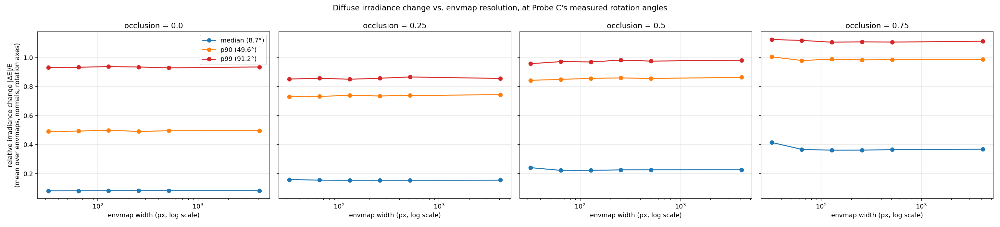
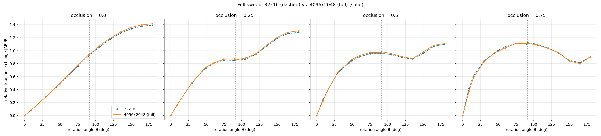
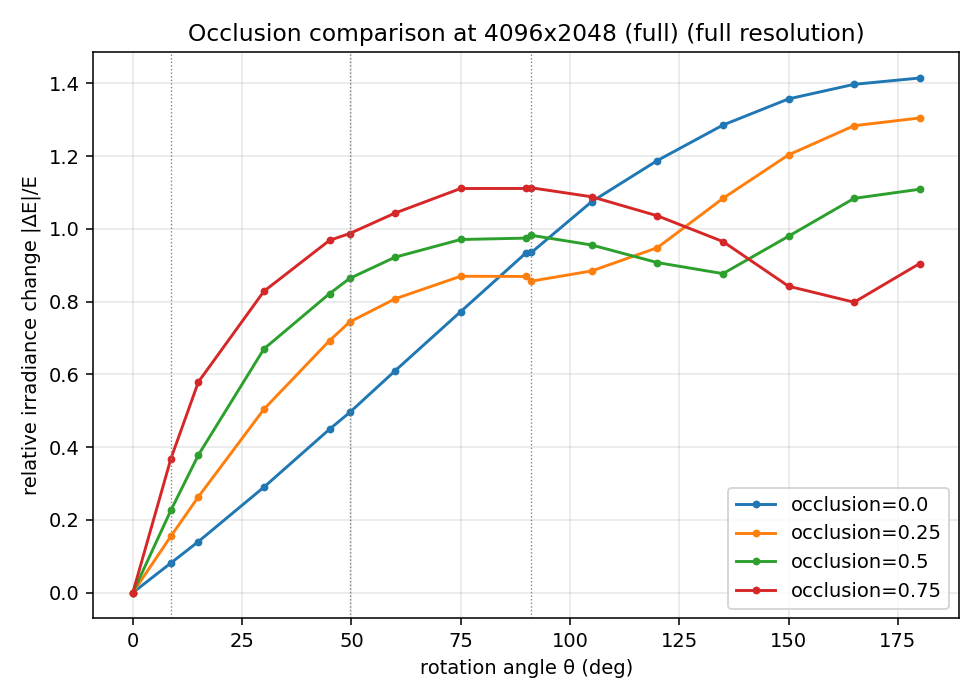

# Irradiance-vs-resolution frequency test

**Standalone numerical experiment.** No LumiMotion code, models, or checkpoints are
touched — `scripts_local/irradiance_frequency_test.py` and
`scripts_local/plot_irradiance_frequency_test.py` only read the existing 32×16
benchmark envmap files (to discover their rotation convention) and download the
original 4K Poly Haven source HDRIs.

## The question

Probes B, C, and D (`docs/test1_probe_{b,c,d}*.md`) found little to no measurable
error from freezing a surfel's outgoing radiance under deformation. Every envmap in
the benchmark is 32×16 — a very low-frequency light probe. **Is that null result a
property of the lighting resolution, or does it hold generally?** Concretely: how
much does diffuse irradiance change when a surface normal rotates, as a function of
environment map resolution — and does self-shadowing change the answer?

## Answer, up front

**Relative irradiance change stays essentially flat across resolution — from 32×16
all the way to native 4K (4096×2048), a 128× change in linear resolution — at every
rotation angle and every occlusion level tested. It does not grow at high
resolution. Occlusion does not change that answer.** What occlusion *does* change is
the magnitude of the effect at small angles (see below) — but not its
resolution-independence.

This is *not* the same as saying the effect is small. At the rotation angles Probe C
actually measured on dynamic Gaussians, the "correct" physical irradiance change is
substantial — median rotation (8.7°): ~8% unoccluded, up to ~42% at 75% occlusion;
p90 rotation (49.6°): ~49–100%; p99 rotation (91.2°): ~93–112%. These are not "a few
percent." **The combination of these two findings is the point**: a genuinely large
physical effect exists at the rotation magnitudes present in the data, at *every*
resolution including the coarse 32×16 the benchmark actually ships — so Probes B/C/D's
null result cannot be explained by "the envmap is too low-frequency for the effect to
show up." Whatever explains those probes' null results, it is not lighting
resolution.

## Method

**Direct hemispherical integration**, not SH projection (SH truncation is itself a
low-pass filter and would have biased the answer toward "resolution doesn't
matter" regardless of what's actually true). For an equirectangular envmap with
texel solid angle `sin(θ)·dθ·dφ`, diffuse irradiance for a query normal `n` is:

```
E(n) = Σ_texels  L(texel) · max(0, dir(texel)·n) · solid_angle(texel)
```

computed on GPU as a chunked batched matmul (texel directions × query normals),
radiance taken as the mean of the 3 color channels (a scalar "radiance" simplification
for this frequency-content question, not a color-accurate computation).

**Envmaps**: the same 4 assets used by the benchmark — chapel_day, dam_wall,
golden_bay, small_harbour_sunset. Their original 4K `.hdr` sources were downloaded
from Poly Haven (`api.polyhaven.com/files/{name}` → the `4k` HDR URL); network access
was available in this environment, so no manual fetch was needed. **Rotation
matching**: the benchmark's 32×16 files are the same 4K source, downsized and then
rolled horizontally by an angle encoded in the filename (chapel_day=rot0,
dam_wall=rot90, golden_bay=rot330, small_harbour_sunset=rot270). This was verified,
not assumed: reproducing each 32×16 file from its downloaded 4K source at the
claimed rotation gives MSE ≈ 3×10⁻⁴, an order of magnitude below every other
candidate shift tested (0°–350° in 10° steps, both directions) — confirms both the
rotation convention and that these are indeed the same source assets. The rotation
values are auto-discovered from the shipped filenames at runtime (with the values
above as a fallback), not hardcoded blindly. Every resolution in the ladder below is
built from the **same rotated** 4K source via `cv2.INTER_AREA` (area/box)
downsampling — the same operation that produced the shipped 32×16 files — so the
32×16 rung reproduces the actual benchmark file almost exactly; this is this
experiment's own methodology check.

**Resolution ladder**: 32×16, 64×32, 128×64, 256×128, 512×256, and the native
4096×2048 4K download ("full") — six rungs spanning a 128× range in linear
resolution.

**Rotation sampling**: 3,000 base normals (Fibonacci sphere, uniform over the full
sphere), and for each rotation angle θ, 6 random perpendicular directions per
normal (`n' = cos(θ)·n + sin(θ)·w`, `w` a random unit vector in the tangent plane at
`n` — this exactly parameterizes "move `n` by angular distance θ toward a random
direction," matching "rotation by θ, averaged over random rotation axes"). Reported
statistic: `|E(n) − E(n')| / E(n)`, meaned over all 3,000×6 = 18,000 samples (per
envmap/resolution/occlusion/θ), then meaned again over the 4 envmaps for the headline
numbers. θ swept 0°–180° in 15° steps, with the three Probe C angles (8.7°, 49.6°,
91.2°) inserted exactly.

**Occlusion model**: a spherical cap centered at the query normal itself, half-angle
`α = arccos(1 − f)`, blocking exactly a solid-angle fraction `f` of that normal's own
hemisphere — a closed form (a cap of half-angle ≤90° centered at `n` is entirely
inside `n`'s hemisphere, so its blocked solid angle is exactly `f·2π` with no
per-normal numerical root-finding needed). **This is a simplification, stated
plainly**: a real fold more plausibly occludes near-grazing/horizon directions on one
side, not a disk centered on the normal. What matters for the frequency-content
question under test is that occlusion multiplies the integrand by a hard-edged
binary mask — the actual mechanism — regardless of exactly where that mask is
centered. The occluder is rigidly attached to the local normal (centered at `n` when
evaluating `E(n)`, centered at `n'` when evaluating `E(n')`), matching a fold whose
geometry is fixed relative to the surface. Tested at f = 0, 0.25, 0.5, 0.75.

## Results

### Headline table (mean over 4 envmaps, %)

| occlusion | angle | θ | 32×16 | 64×32 | 128×64 | 256×128 | 512×256 | 4096×2048 (full) |
|---|---|---|---|---|---|---|---|---|
| 0.0 | median | 8.7° | 8.07% | 8.09% | 8.10% | 8.14% | 8.14% | **8.15%** |
| 0.0 | p90 | 49.6° | 49.12% | 49.32% | 49.80% | 49.13% | 49.49% | **49.52%** |
| 0.0 | p99 | 91.2° | 93.28% | 93.31% | 93.80% | 93.51% | 92.92% | **93.52%** |
| 0.25 | median | 8.7° | 15.79% | 15.52% | 15.40% | 15.48% | 15.42% | **15.51%** |
| 0.25 | p90 | 49.6° | 73.11% | 73.26% | 73.90% | 73.50% | 73.88% | **74.40%** |
| 0.25 | p99 | 91.2° | 85.20% | 85.76% | 85.05% | 85.76% | 86.62% | **85.62%** |
| 0.5 | median | 8.7° | 24.11% | 22.22% | 22.22% | 22.59% | 22.60% | **22.62%** |
| 0.5 | p90 | 49.6° | 84.31% | 84.96% | 85.68% | 85.97% | 85.57% | **86.37%** |
| 0.5 | p99 | 91.2° | 95.79% | 97.21% | 96.99% | 98.26% | 97.57% | **98.22%** |
| 0.75 | median | 8.7° | 41.51% | 36.69% | 36.13% | 36.16% | 36.54% | **36.80%** |
| 0.75 | p90 | 49.6° | 100.52% | 97.99% | 98.90% | 98.39% | 98.51% | **98.71%** |
| 0.75 | p99 | 91.2° | 112.47% | 111.83% | 110.61% | 110.85% | 110.69% | **111.28%** |



Every row is flat within 1–2 percentage points across the entire 32×16→4K range,
**except** occlusion ≥0.25 at the median angle, where there's a real but small drop
from 32×16 to 64×32 (e.g. 41.51%→36.69% at occlusion=0.75) and then flatness from
64×32 onward. This one exception is explained below, not glossed over.

### Full angular sweep



The 32×16 and native-4K curves are visually indistinguishable across the entire
0°–180° range, at every occlusion level. This is the strongest form of the
resolution-independence result: not just at three specific angles, but everywhere.

### Occlusion comparison (native 4K)



Occlusion's real effect is on the **shape** of the curve at small-to-moderate angles,
not on resolution-dependence: at θ=8.7°, going from 0% to 75% occlusion roughly
**5×'s** the relative irradiance change (8%→42%). Occlusion adds a hard edge (the cap
boundary) close to the normal, which a small rotation crosses more readily than the
smooth, broad cosine lobe of the unoccluded case — exactly the "occlusion
reintroduces high frequencies" mechanism the task described. This is a real,
resolution-**independent** amplification of small-angle sensitivity, confirmed at
every resolution tested, not an artifact of any particular resolution.

## The one resolution effect that does exist, and why it's not what it might look like

The 32×16→64×32 drop at low angles under occlusion (most visible at occlusion=0.75:
41.51%→36.69%, occlusion=0.5: 24.11%→22.22%) is a **discretization artifact of the
occluder edge against a very coarse texel grid**, not a "fine light detail gets
washed out" effect. At occlusion=0.75, the blocking cap has half-angle
`arccos(0.25) ≈ 75.5°` — at 32×16, azimuthal texels are `360°/32 = 11.25°` wide,
so the cap boundary is resolved by only a handful of texels, and exactly which
texels fall inside vs. outside the boundary is sensitive to the cap's precise
orientation relative to the (coarse, fixed) texel grid — a quantization effect on
the **mask edge**, unrelated to the envmap's own spatial frequency content. This
artifact is confined entirely to the 32×16→64×32 step; from 64×32 upward (a further
64× increase in linear resolution, all the way to native 4K) there is no further
drift. If the effect being tested for were genuinely about the envmap's own
high-frequency lighting detail mattering, it should have kept changing as resolution
increased toward 4K — it doesn't.

## What this means for Probes B, C, and D

This experiment establishes a ground truth the prior probes didn't have: **at the
rotation magnitudes Probe C actually measured on dynamic Gaussians, a physically
correct diffuse-irradiance recomputation should change substantially — 8% at the
median, 49–100% at p90, 93–112% at p99 — and this is true at 32×16 resolution, the
resolution actually used to train and light every scene in this benchmark, just as
much as at native 4K.** That rules out the specific hypothesis motivating this
experiment (low envmap frequency masking a real effect). It does not, on its own,
explain Probe C's near-zero per-Gaussian correlation between stored-radiance error
and normal rotation — if anything, it sharpens that finding: the "correct" physical
signal Probe C's diagnostic was looking for should have been large and detectable at
exactly the resolution in use, not marginal or beneath the noise floor of a
low-frequency light. Whatever suppresses that signal in LumiMotion's actual
reconstruction (the learned shadow-modulation compensation, insufficient training
signal to fit view/time-dependent radiance in the first place, some other mechanism)
is not "the envmap doesn't have enough spatial detail for it to matter" — this
experiment closes off that explanation directly.

## Limitations

1. **Radiance reduced to greyscale** (mean of RGB) throughout, for computational
   simplicity — a color-resolved version could show different resolution-dependence
   per channel, not checked here.
2. **Occluder geometry is a normal-centered cap**, a real simplification of "a fold
   or nearby surface," documented above. An off-center, horizon-hugging occluder
   (arguably more physically typical of a body fold) was not tested; the qualitative
   conclusion (occlusion changes small-angle sensitivity, not resolution-dependence)
   is expected to be robust to this choice since it follows from the presence of a
   hard edge in the integration domain generally, but the specific magnitudes above
   are tied to this specific occluder model.
3. **Random-axis sampling uses 6 samples per normal per angle** (18,000 total per
   condition) — ample for the stable means reported (visible in the smoothness of
   the sweep curves), but percentile estimates (only median/p90 computed, stored in
   `results.json`, not all reported here) carry more sampling noise.
4. **Downsampling via `cv2.INTER_AREA`** (a standard image-pixel box filter) rather
   than a solid-angle-correct spherical filter — matches how the benchmark's own
   32×16 files were evidently produced (confirmed by the near-exact MSE match), so
   this is the right choice for reproducing *this benchmark's* resolution ladder
   specifically, but it is not the only defensible way to downsample an
   equirectangular map, and a solid-angle-aware filter could shift the absolute
   numbers slightly (unlikely to change the flat-across-resolution conclusion, which
   is about *relative* change between rungs of a self-consistent ladder).
