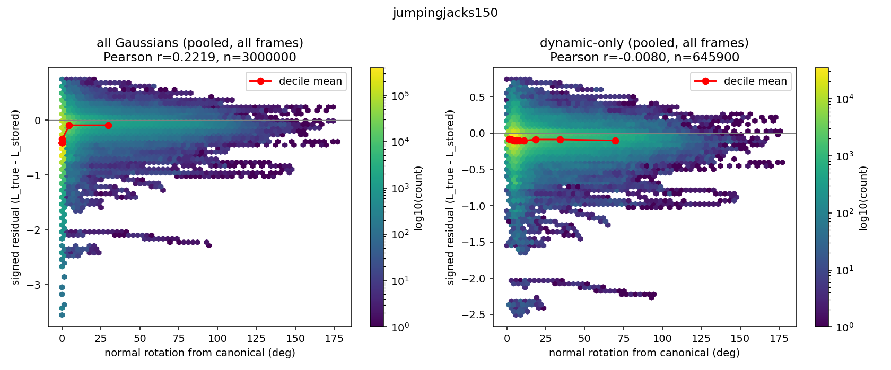
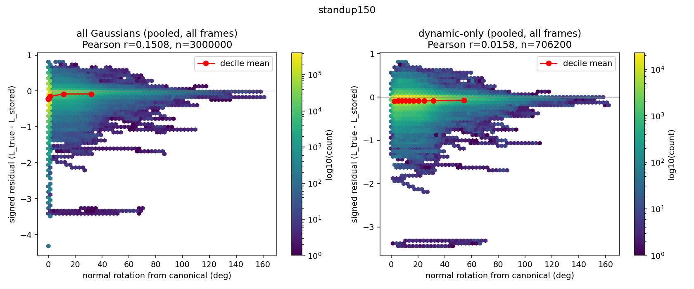
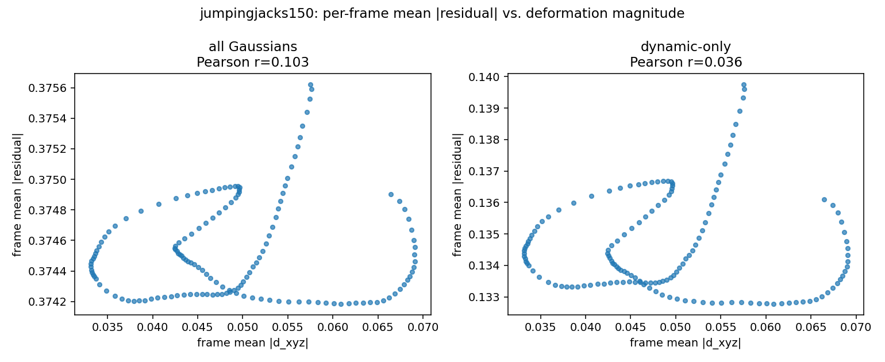
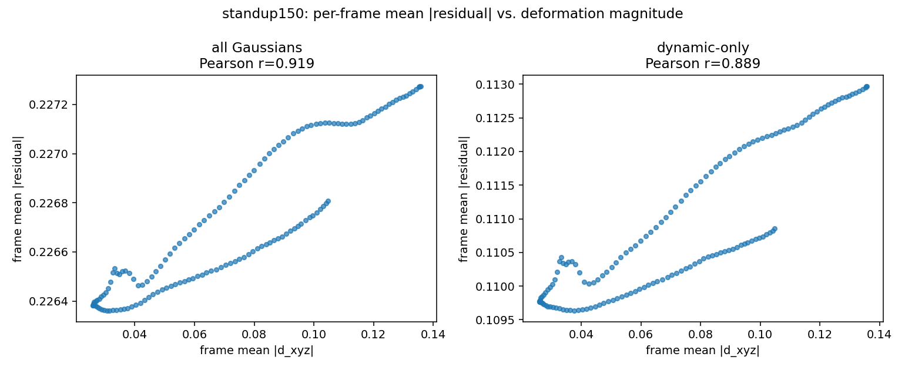
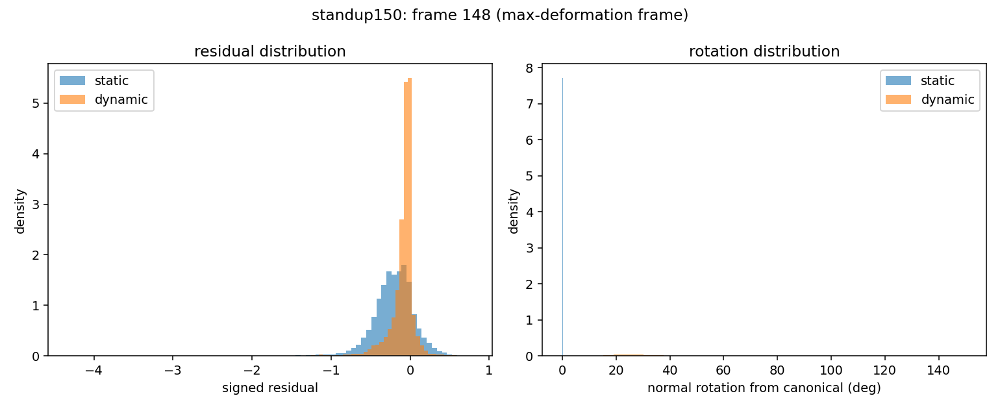

# Test 1, Probe C — per-Gaussian transport residual

**Question tested:** does a surfel's stored radiance (`_albedo_dc_stage1`, canonical
and frame-independent) diverge from its true, frame-t diffuse outgoing radiance
(deformed normal, current self-shadowing, trained envmap) — and does that gap grow
with how much the surfel has rotated away from its canonical orientation? This is
the direct, per-Gaussian version of the mechanism CLAUDE.md describes and Probes B
and D tried to detect indirectly through renders.

**Verdict, up front, unsparing as requested:**

1. **The canonical-pose sanity check fails as literally stated — the residual is
   NOT near zero.** Mean |residual| at zero deformation is 0.38 (jumpingjacks) /
   0.23 (standup) against a signal (`L_true`) of only 0.31 / 0.33 — the "error" is
   comparable to or larger than the quantity itself, even with no deformation
   applied at all. **This is investigated in detail below** and the most likely
   explanation is not a bug in this script but a genuine mismatch between what
   `L_stored` and `L_true` were each defined to be (see "Canonical sanity check").
   It means the *raw* residual and its *relative* magnitude are not trustworthy,
   standalone measures of "how wrong the frozen radiance is due to deformation" —
   they're dominated by a large, roughly deformation-independent baseline. A
   second, baseline-immune metric (change from the Gaussian's own canonical value)
   is used throughout as the more trustworthy read.
2. **The single most important number — per-Gaussian, dynamic-only correlation
   between residual and normal rotation, pooled across all 150 frames — is
   essentially zero in both scenes** (jumpingjacks: r = **−0.008**, n=645,900;
   standup: r = **+0.016**, n=706,200). This is the direct test the probe was built
   to run, at maximum statistical power (600K+ points), and it is a clean, flat
   null result in both scenes, for two different motion types.
3. **The positive correlation seen when *all* Gaussians (static + dynamic) are
   pooled together (r=0.22 / 0.15) is a group-split artifact, not a dose-response
   relationship** — it comes from static Gaussians (78%/76% of the population,
   clustered at exactly 0° rotation) having a systematically different residual
   distribution than dynamic ones, not from residual increasing continuously with
   rotation within either group. The scatter plots make this directly visible.
4. **The one place a strong, clean correlation does appear — standup's frame-level
   aggregate (r=0.92 all, r=0.89 dynamic-only) — has a real but tiny effect size**:
   mean |residual| changes by **0.4%** from the least- to the most-deformed frame in
   the entire animation, riding on top of a large, roughly constant baseline.
   Statistically real, practically negligible, and only present in the monotonic
   (standup) motion, not the periodic (jumpingjacks) one — consistent with a
   confound (something else trending monotonically over a monotonic animation)
   rather than a targeted deformation effect, especially since it's contradicted by
   the same scene's own near-zero per-Gaussian result.

**Net: this is a clear negative.** At the level of statistical power and directness
this probe was designed for, there is no detectable relationship between a
Gaussian's normal rotation and its stored-radiance error, once the static/dynamic
population split is accounted for. Combined with Probes B and D's weak, confound-
dominated results, three independent measurement strategies now agree: this fork
has not found evidence, at a magnitude distinguishable from noise and confounds,
that LumiMotion's frozen-transport mechanism produces a deformation-correlated
error large enough to detect with these methods, on these two scenes.

---

## Method

**New standalone module** (`scripts_local/probe_c_transport_residual.py`), not a
change to `render_ir.py` — per `docs/test1_hook_points.md`'s own recommendation
that `render_ir.py` is pixel-space by construction and this needs a sibling code
path with Gaussian centers as query points instead of rasterized pixels.
`GaussianTracer`, `EnvLight`, and `sample_incident_rays` are reused unmodified; no
existing file was changed for this probe.

Per frame: `deform.step()` for that fid gives `d_xyz`/`d_rotation` (`d_scaling` is
zeroed by the network, `utils/time_utils.py:192`); `gaussians.update_bvh()` refits
the ray-tracer BVH to the deformed geometry (`build_bvh` on the first frame only,
matching the tracer's required build-then-update sequence,
`surfel_tracer/raytracer.py:79-82`); the deformed normal is the third column of
`build_rotation(get_rotation_bias(d_rotation))`, matching `gaussian_model.py`'s
own internal derivation (`gaussian_model.py:648-656`); visibility comes from
`pc.trace()` with ray origins at deformed Gaussian centers offset along each
individual sample's own direction by `pipe.light_t_min` — this exactly mirrors
`render_ir.py:482,512`'s ray-origin construction (`position.unsqueeze(1) +
incident_dirs * pipe.light_t_min`), **not** a fixed offset along the surface
normal as a literal reading of the task brief might suggest; the established,
working convention was used instead of a plausible-sounding variant, per this
project's "read before writing" rule. Outgoing radiance is diffuse-only:
`envlight(dirs) * visibility * cos(theta) * albedo/pi`, Monte-Carlo integrated
exactly as `rendering_equation()` integrates its direct term — no specular (`w_o`
is undefined for an isolated surfel; the effect under test is an irradiance
effect), no one-bounce indirect term (that term *is* what consumes `L_stored`,
so including it here would be circular).

**Normal orientation**: `camera_center=None` throughout (no view-dependent flip).
The outward sign is resolved once at canonical pose (flip any normal pointing
toward the scene's canonical centroid — a simplification, exact for star-shaped
geometry, imperfect in concavities like armpits or between the legs) and then
rigidly propagated through each frame's deformation rotation — the same Lagrangian
propagation the author's own method will use, and why signed (not
`abs()`-folded, unlike Probe B's per-frame-independent normal metric) rotation
angles are meaningful here.

**Runtime**: ~1.6s/frame (jumpingjacks, 146,400 Gaussians) and ~1.3s/frame
(standup, 156,893 Gaussians) at `--n_samples 512`, chunked in batches of 20,000
Gaussians; ~4 and ~3.5 minutes respectively for the full 150-frame sequence plus
the canonical-pose pass. Both scenes' models under
`outputs_test1/chapelday_goldenbay/`, checkpoint iteration 55000. A fixed random
subsample of 20,000 Gaussians (of 146,400 / 156,893) was tracked across all 150
frames for the pooled per-Gaussian diagnostics (diagnostic 1); full-population
(all Gaussians) statistics are exact, computed fresh every frame, for everything
else.

`L_stored` = `srgb_to_rgb(SH2RGB(_albedo_dc_stage1))`, the degree-0 (direction-
independent) SH term only — matching `render_ir.py:148`'s literal use of
`SH2RGB(pc._albedo_dc_stage1[:, :1])`, minus the frame-dependent shadow-modulation
multiply (that correction is itself part of what this probe exists to bypass, see
CLAUDE.md) and minus `_albedo_rest` (a genuine view-direction dependence with no
analogue on the diffuse-only, viewer-free `L_true` side of this comparison).

---

## Canonical sanity check — read this first

| | jumpingjacks | standup |
|---|---|---|
| mean \|residual\| at canonical pose, all Gaussians | **0.377** | **0.227** |
| mean \|residual\| at canonical pose, dynamic-only | 0.144 | 0.113 |
| signed mean residual, all | **−0.345** | **−0.185** |
| `L_stored` mean | 0.650 | 0.516 |
| `L_true` mean (canonical) | 0.306 | 0.331 |

This does not pass the "near zero" bar the task set as the sanity check, and per
the task's own instruction that failing this check makes "everything else...
suspect," it's reported first and taken seriously, not explained away.

**What was checked to rule out a computation bug:**
- **Stable across sample count**: 32 vs. 512 hemisphere samples gives essentially
  identical canonical numbers (mean |residual| 0.390 vs. 0.377) — this is a
  systematic effect, not Monte Carlo noise.
- **Sign-propagation math is exact by construction**: at literal canonical pose
  (`d_rotation=0`), the deformed-normal function reduces algebraically to the same
  expression used to resolve the canonical sign in the first place — there is no
  floating-point or logic path by which this could introduce a large error.
- **The direction of the gap is consistent with a specific, identifiable
  explanation, not noise**: `L_true < L_stored` almost uniformly (signed mean
  strongly negative in both scenes, both populations).

**Most likely explanation** (an interpretation, stated as such, not proven):
`_albedo_dc_stage1` was not trained to represent diffuse-only irradiance. Per
`docs/lumimotion_eval.md`'s audit of `train_stage2.py`, its training signal is
`loss_sh` (`train_stage2.py:196-200`), which fits the SH bank (DC **and** rest
coefficients together) to match GT color, i.e. the **full** appearance —
specular highlights, whatever residual indirect content survives in the fit,
everything — evaluated at the camera's viewing angle. The degree-0 term used here
as `L_stored` is one coefficient of that fit, not a quantity that was ever asked to
equal a pure Lambertian irradiance integral. A diffuse-only `L_true` missing
specular content would be expected to sit below a target that was fit to include
it — which is exactly the sign and rough scale of what's observed (`L_true` off by
roughly half from `L_stored`, in the direction "missing brightness"). This is a
**definitional mismatch between the two quantities as specified for this probe**,
most likely, not a bug — but it means the raw residual is not a clean
"deformation error" signal, and everything downstream in this document either
works around it explicitly (the canonical-relative metric) or is reported with
this caveat attached (the raw residual and its relative-magnitude numbers).

**Consequence for the rest of this analysis**: alongside the raw residual
`L_true(t) − L_stored`, every diagnostic below also reports **`ΔL(t) = L_true(t) −
L_true(canonical)`** — the change in a Gaussian's own true outgoing radiance
relative to its own canonical-pose value. This metric never involves `L_stored` and
is completely immune to the baseline mismatch just described; it directly answers
"how much does deformation itself change this Gaussian's true radiance," which is
the quantity closest to what the frozen-transport hypothesis needs to be large for.

---

## Diagnostic 1 (priority) — does the residual grow with deformation?

### Per-Gaussian, pooled across all 150 frames (the key number)

| | jumpingjacks (n) | standup (n) |
|---|---|---|
| Pearson r(residual, rotation), **all** Gaussians | 0.222 (3,000,000) | 0.151 (3,000,000) |
| Pearson r(residual, rotation), **dynamic-only** | **−0.008** (645,900) | **+0.016** (706,200) |
| Pearson r(relative residual, rotation), dynamic-only | −0.027 | −0.013 |

The right-hand panel of each figure (dynamic-only) shows exactly what the
correlation number says: a flat decile-mean line hovering at roughly −0.1 across
the entire 0°–175° rotation range, inside a scatter cloud spanning roughly +0.8 to
−3.5 that rotation angle explains essentially none of. The left-hand panel (all
Gaussians) shows *why* the naive all-population number is misleadingly positive: a
dense cluster of static Gaussians sits at exactly 0° with one residual level, and
the (still flat) dynamic cloud sits at a slightly different level across all
rotation angles — two groups with different means, not a trend.

### Per-frame (both scenes, all + dynamic-only)

| | jumpingjacks | standup |
|---|---|---|
| corr(frame-mean \|residual\|, frame-mean \|d_xyz\|), all | 0.103 | **0.919** |
| corr(frame-mean \|residual\|, frame-mean \|d_xyz\|), dynamic-only | 0.036 | **0.889** |
| range of frame-mean \|residual\| (all), min→max frame | 0.3742→0.3756 | 0.2264→0.2273 |
| relative change, min→max deformation frame | **0.38%** | **0.40%** |

standup's r=0.92/0.89 looks like strong confirmation until the y-axis is read: mean
|residual| moves by **0.4% of its own value** across the full range from the
least- to the most-deformed frame in the entire sequence — a real, smooth,
statistically clean trend (the scatter traces an almost noiseless curve, visible in
the plot), but one riding on top of a baseline residual roughly **250× larger**
than the trend's own amplitude. jumpingjacks shows the same tiny amplitude with no
clean trend at all — its scatter traces a closed loop (consistent with a periodic
motion revisiting similar deformation magnitudes at different points in the cycle,
each with a slightly different, non-deformation-magnitude-dependent residual). The
fact that a real, clean deformation-magnitude relationship appears **only** in the
monotonic animation and **not** the periodic one, while both show a similarly
negligible amplitude and the *per-Gaussian* dynamic-only correlation is flat in
both, is more consistent with "something else that also trends monotonically over
this specific animation" (frame index itself, cumulative floating-point drift,
envmap sampling pattern relative to a slowly-turning camera, etc.) than with a
deformation-specific causal effect. This was not tracked down further — flagged as
the natural next thing to check before trusting standup's frame-level number.

### Canonical-relative metric (`ΔL`, baseline-immune)

| | jumpingjacks, all | jumpingjacks, dyn | standup, all | standup, dyn |
|---|---|---|---|---|
| mean `ΔL(t)` averaged over all 150 frames | 0.00299 | 0.01358 | 0.00096 | 0.00520 |

Small in absolute terms relative to `L_true`'s own ~0.3 magnitude (roughly 1–4%),
and consistent with diagnostic 1's other views: whatever the deformation-induced
change in true outgoing radiance is, it is small.

---

## Diagnostic 2 — restrict to dynamic Gaussians

Already threaded through every number above (`all` vs. `dynamic-only` columns
throughout). Restated because it's the diagnostic that most changes the picture:
**every relationship that looks meaningful in the `all`-Gaussian view collapses to
near-zero or reverses when restricted to Gaussians that actually deform.** This is
not the "dilution toward zero" the task anticipated (static Gaussians pulling a
real dynamic-population effect down by sheer numerical weight) — it's that the
`all`-population number was substantially a between-group artifact to begin with,
and the within-dynamic-group effect was already close to zero.

`n_dynamic` / `n_gaussians`: jumpingjacks 32,200 / 146,400 (22.0%); standup 37,218 /
156,893 (23.7%).

---

## Diagnostic 3 — distribution, not just mean

Prior probes reported mean normal rotation of 2.8°–5.3° (Probe B, unsigned,
`abs()`-folded, all Gaussians). This probe's signed, per-Gaussian numbers, at each
scene's own maximum-deformation frame, restricted to dynamic Gaussians (where the
rotation actually happens):

| | jumpingjacks (frame 142, max \|d_xyz\|) | standup (frame 149, max \|d_xyz\|) |
|---|---|---|
| rotation, mean / median / p90 / p99 / max (deg) | 16.9 / 8.7 / 49.6 / 91.2 / **148.0** | 30.0 / 27.3 / 46.4 / 83.4 / **164.5** |
| \|residual\|, mean / median / p90 / p99 / max | 0.134 / 0.087 / 0.298 / 0.729 / 5.39 | 0.113 / 0.060 / 0.265 / 0.810 / 5.51 |

The long tail is real and substantial: p99 rotation exceeds 83–91° in both scenes
(a large fraction of a full quarter-turn) and the maximum exceeds 145° — a near
full reversal, for at least some dynamic Gaussians. The mean of 2.8–5.3° reported
in Probe B was computed over **all** Gaussians (diluted by the 76-78% static
population, `abs()`-folded, and averaged) — restricting to dynamic Gaussians alone
and looking at the tail reveals substantially larger individual rotations than that
number suggested. **This large a rotation tail existing, combined with
diagnostic 1's flat dynamic-only correlation, is itself informative**: even the
Gaussians undergoing genuinely large reorientation don't show a correspondingly
large stored-radiance error relative to Gaussians that barely moved.

The residual distribution itself is heavy-tailed in both static and dynamic
populations (max ~5.4–5.5, roughly 15-40× the median) — and, counter to a naive
expectation, **static Gaussians show a wider residual spread than dynamic ones** in
both scenes' max-deformation-frame histograms (visible in the standup panel above:
the blue/static distribution has visibly heavier shoulders than the orange/dynamic
one). Static Gaussians never move, so this spread cannot be a deformation effect —
it's presumably driven by whatever produces the canonical-pose gap discussed above
(e.g. specular content, Stage-1 fit quality varying by material/location), further
supporting that most of the residual's magnitude and spread is unrelated to
deformation.

---

## Diagnostic 4 — relative magnitude

| | jumpingjacks, all | jumpingjacks, dyn | standup, all | standup, dyn |
|---|---|---|---|---|
| mean relative \|residual\| (averaged per-frame) | 6060% | 12540% | 8960% | 26130% |

These numbers are reported as computed, but **should not be read as "the frozen
radiance is wrong by thousands of percent" in the way that phrase normally
implies** — they are inflated, likely by orders of magnitude, by the canonical
baseline mismatch (`L_stored` itself sits on a different scale than `L_true` for
reasons unrelated to deformation, as established above; dividing a residual that
includes this large fixed offset by a small `L_stored` value produces exactly this
kind of blown-up percentage). The relative-magnitude numbers are included because
they were asked for and are computed correctly given the task's own definitions of
`L_stored`/`L_true`, but given the canonical-check finding, they are the least
trustworthy numbers in this document and are not used to support any conclusion
above. The pooled Pearson correlation on *relative* residual (diagnostic 1's third
row, −0.03 to −0.01, dynamic-only) is a sturdier way to ask the same "does relative
error track deformation" question, and it's as flat as the absolute version.

---

## What this probe does and does not support

**Supports:**
- Nothing about the frozen-transport hypothesis specifically. The one clean,
  statistically strong result (standup's frame-level r=0.92) has a negligible
  effect size and no matching signal at the per-Gaussian level in the same scene,
  making "confound" a more parsimonious explanation than "confirmed mechanism."

**Does not support:**
- **The core, direct prediction — that a Gaussian's own stored-radiance error
  should track its own normal rotation — is not observed.** Pooled over 645,900
  (jumpingjacks) and 706,200 (standup) dynamic-Gaussian-frame pairs, the
  correlation is indistinguishable from zero (−0.008, +0.016).
- **The apparent "all-Gaussian" correlations (0.15–0.22) are artifacts of the
  static/dynamic population split**, not evidence of a continuous dose-response
  relationship, as the pooled scatter plots show directly.
- **Where a clean aggregate trend does exist (standup, frame-level), its amplitude
  is negligible** (0.4% of the baseline residual) and scene-specific in a way
  (monotonic motion only) that points toward a time-correlated confound rather than
  a deformation-specific effect.
- **The canonical-pose sanity check the task specified does not pass**, which
  means the raw residual magnitude and especially the relative-magnitude numbers
  (diagnostic 4) reflect mostly a definitional baseline mismatch between what
  `_albedo_dc_stage1)` was trained to represent and the diffuse-only quantity
  computed here — not primarily a deformation-tracking failure. This was worked
  around (the canonical-relative `ΔL` metric) rather than hidden, but it means this
  probe cannot, on its own, put a number on "how big is the frozen-transport error
  in absolute radiometric terms" — only on "does it grow with deformation," to
  which diagnostics 1–3 answer no.

**Combined with the two prior probes**: Probe B found a weak positive
render-space signal dominated by the same non-monotonicity issues seen here; Probe
D's training-light run found the same weak, confound-heavy pattern and its
novel-illumination rerun found the signal strengthened somewhat but remained
dominated by a stronger albedo-error confound and failed its own most important
diagnostic (deformation-magnitude scaling) in one of two scenes. Probe C, designed
specifically to bypass all of those confounds by measuring the quantity directly in
Gaussian space, finds no relationship at the direct per-Gaussian level in either
scene. Across three different measurement strategies, none has produced a clean,
sizeable, deformation-scaling-confirmed positive result.

---

## Limitations

1. **The canonical sanity check's failure is explained by inference, not proven.**
   The specular/full-appearance-fit explanation is the most likely candidate given
   the sign, stability, and rough magnitude of the gap, but it was not directly
   verified (e.g. by comparing against a canonical-pose full rendering-equation
   evaluation including specular, which would require threading `_albedo_rest` and
   a chosen `w_o` back in — exactly the complexity this probe was designed to
   avoid). If the true explanation is instead a genuine bug, it would need to
   affect `L_true` and `L_stored` by a similar, roughly constant multiplicative-ish
   factor across all Gaussians and frames to produce the pattern observed (stable
   under 16× more samples, consistent sign, present even for never-deforming static
   Gaussians) — possible but a less natural fit to the evidence than the
   explanation offered.
2. **Outward-normal sign resolution (centroid heuristic) is exact only for
   star-shaped geometry.** Concave regions (armpits, between the legs, the standup
   figure's crouch) could have a wrongly-resolved canonical sign for some
   Gaussians, which would then propagate a consistently-wrong (but still
   internally consistent frame-to-frame) sign through the whole sequence for those
   Gaussians. Not checked directly; would show up as isolated, geometrically
   clustered outliers in the residual field if present, which the current
   aggregate/pooled analysis wouldn't surface.
3. **Diffuse-only, no specular.** A deliberate, task-specified simplification.
   Any part of the true frozen-transport error that manifests specifically through
   the specular channel (plausible, since roughness/specular response is itself
   viewing- and geometry-dependent) is invisible to this probe by construction.
4. **20,000-Gaussian subsample for the pooled per-frame-tracked diagnostic** (vs.
   full-population for everything else) — a fixed random subset, large enough
   (up to ~3M pooled points) that sampling noise is not a concern for the
   correlation numbers reported.
5. **`spheres_v5_spec32` still has no trained checkpoint** — no negative control
   scene was available for this probe either, same gap as Probes B and D.
6. **The standup frame-level confound (item 4 above) was not tracked down.** If it
   matters for future work, the natural next step is checking whether the trend
   persists when regressed against frame index directly (removing deformation
   magnitude as a predictor) or against camera-relative envmap sampling geometry.
