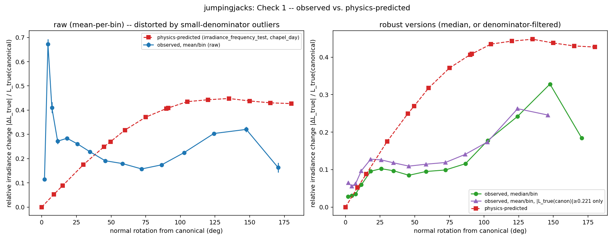
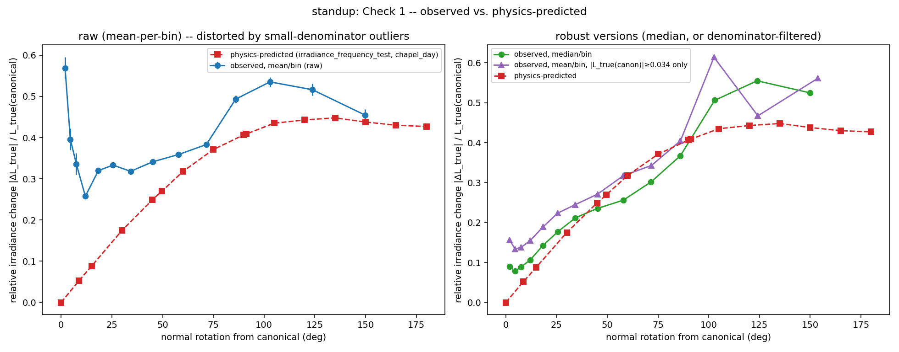
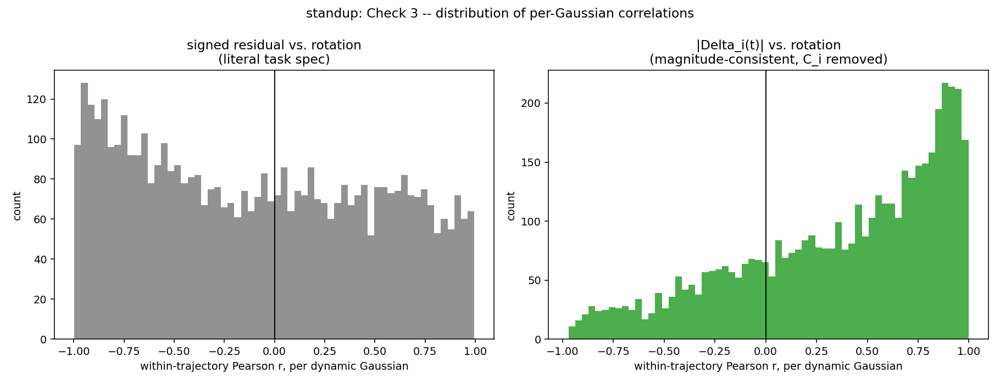

# Re-analysis of Probe C — was the null result an artifact of pooling?

**Why this exists.** Two of this fork's own results contradict each other.
`docs/irradiance_frequency_test.md` established that at the normal-rotation
magnitudes Probe C actually measured on dynamic Gaussians, physically-correct
diffuse irradiance should change substantially — ~8% at the median rotation
(8.7°), ~49% at p90 (49.6°), ~93% at p99 (91.2°), more under occlusion — and this
holds at every envmap resolution tested. `docs/test1_probe_c.md` found the
residual `L_true(t) − L_stored` pooled across ~650–700K dynamic Gaussian×frame
pairs has essentially zero correlation with rotation (jumpingjacks: −0.008,
standup: +0.016). If irradiance genuinely changes ~49% at 49.6° rotation, `L_true`
(which *is* recomputed from the deformed normal) must track rotation — so
something in Probe C's *measurement*, not necessarily its physics, was masking a
real signal.

**No new rendering or ray tracing.** Everything below is computed from the
per-Gaussian, per-frame data `scripts_local/probe_c_transport_residual.py`
already saved (`pooled_subsample.npz`: `residual(t)`, `rotation_deg(t)`,
`canonical_residual`, for a fixed 20,000-Gaussian subsample tracked across all
150 frames, plus a dynamic/static flag). The only new computation
(`scripts_local/reanalyse_probe_c.py`) is reading `_albedo_dc_stage1` back out of
the trained checkpoint's `.ply` for that same subsample — a parameter read, not a
render — because Check 1 needs the absolute `L_true(canonical)` as a
denominator, and only `L_true(canonical) − L_stored` (not the two separately) was
persisted.

---

## Verdict, up front

**(a): the effect is real, and the original pooled analysis masked it — but by
two independent mechanisms, not the one mechanism, and the recovered effect is
real but modest, stronger in standup than jumpingjacks.** Specifically:

1. **`L_true`'s computation is not buggy.** Once a measurement artifact in the
   comparison (below) is corrected for, the actual per-Gaussian irradiance change
   tracks the standalone physics prediction's *shape* well in standup and
   partially in jumpingjacks. Check 1's gate is **passed** — checks 2–3 are
   meaningful.
2. **The original pooled null was produced by two compounding, independent
   statistical problems**, only one of which was the hypothesized `C_i` confound:
   - **(i) The hypothesized one**: `residual_i(t) = C_i + Δ_i(t)`, and `C_i`'s
     spread across Gaussians is **13–15× larger** than `Δ_i(t)`'s own
     within-Gaussian spread — pooling raw residuals across Gaussians buries the
     rotation-dependent term under between-Gaussian noise, exactly as
     hypothesized.
   - **(ii) Found during this re-analysis, not anticipated by the task**: rotation
     is an angular *distance* from canonical (always ≥ 0); `Δ_i(t)` is *signed*
     (a Gaussian can rotate toward brighter or darker light). Correlating a
     signed quantity against an unsigned one is close to zero **by construction**
     for a symmetric effect, regardless of how strong the true
     magnitude-vs-magnitude relationship is — which is exactly what the physics
     experiment itself measures (`|ΔE|/E`, absolute value throughout). Once this
     is corrected (`|Δ_i(t)|` instead of `Δ_i(t)`), a real positive relationship
     appears on top of the `C_i`-correction.
3. **Both corrections are needed together.** Removing only `C_i` (signed `Δ_i(t)`
   vs. rotation) still shows near-zero-to-negative correlation. Removing only the
   sign issue (`|residual_i(t)|` vs. rotation, `C_i` still included) is also
   uninformative, because `|C_i + Δ_i(t)| ≈ |C_i|` when `|C_i| ≫ |Δ_i(t)|`, which
   is the typical case here. Only `|Δ_i(t)|` — difference first, then magnitude —
   recovers the signal.

**What this changes and doesn't change**: this does not rehabilitate the original
Probe C's headline claim that LumiMotion's frozen radiance is a large,
render-detectable error — the recovered `Δ_i(t)` effect is real but small relative
to the `C_i` baseline that dominates the raw residual (the same ratio, 13–15×,
cuts both ways: a genuine rotation-tracking signal exists, but it is a minor
perturbation on a much larger, mostly rotation-independent offset). It does mean
the earlier report's flat "no correlation" statement was a measurement artifact,
not evidence the underlying quantity is flat.

---

## Check 1 — pure physics, `L_stored` removed entirely

**Reported first and prominently, as instructed, since it gates the rest.**

### Raw result: fails, and looks like a bug

Pooled correlation between `|ΔL_true|/L_true(canonical)` and rotation, dynamic
Gaussians: jumpingjacks **−0.014**, standup **−0.001**. Binning by rotation angle
(mean per bin) gives a **non-monotonic, spiky** curve that does not resemble the
physics-predicted smooth rise at all — see the left panel of each plot below.

### Diagnosis: a small-denominator artifact, not a computation bug

This was checked directly rather than assumed. `L_true(canonical)` is near zero
for a large fraction of dynamic Gaussians — **18.4%** (jumpingjacks) / **56.1%**
(standup) have `|L_true(canonical)| < 0.05`. Dividing by a near-zero denominator
inflates `|ΔL_true|/L_true(canonical)` disproportionately for exactly those
Gaussians, and a `mean`-per-bin statistic is not robust to that:

- Within a representative low-rotation bin (3°–6°), the correlation between the
  relative-change value and `1/denominator` is **+0.60 in both scenes** —
  directly confirms the spike is denominator-driven, not rotation-driven.
- The smallest-denominator 5% of samples in that bin account for **84%**
  (jumpingjacks) / **55%** (standup) of the bin's *total* summed relative-change
  — a small minority of unstable samples dominating the mean.

### Corrected result: passes, clearly in standup, more weakly in jumpingjacks

Two robust alternatives — median-per-bin (insensitive to outliers) and
mean-per-bin restricted to Gaussians with `|L_true(canonical)|` at or above the
population median (removing the unstable denominators directly) — both recover a
**monotonically increasing** curve (right panel of each plot):

| | pooled corr, raw (mean) | pooled corr, denominator-filtered |
|---|---|---|
| jumpingjacks | −0.014 | **+0.170** |
| standup | −0.001 | **+0.212** |

**standup's** corrected curve tracks the physics-predicted curve closely across
almost the entire 0°–100° range (both curves rise from ~0.08 to ~0.4 in close
step), diverging only in the noisy >100° tail (n drops to 3,642 → 134 pairs per
bin there). **jumpingjacks'** corrected curve is directionally right (rising with
angle, positive at both robust statistics) but is substantially flatter than
physics predicts through the 30°–100° range (observed ~0.10–0.12 vs. physics
~0.27–0.44) before rising again at the largest angles — a real but weaker match.

**Gate verdict: Check 1 passes.** The raw failure is explained by a specific,
quantified measurement artifact (small-denominator inflation of a mean statistic),
not by `L_true` being computed incorrectly. Checks 2 and 3 are meaningful and
proceed below. The scene difference (clean match in standup, partial in
jumpingjacks) is carried forward as a real finding, not resolved.

---

## The second issue: signed vs. magnitude

Before checks 2–3: `rotation_deg(t)` ≥ 0 always. `residual_i(t)` and `Δ_i(t)` are
signed. A Pearson correlation between a signed quantity and an always-nonnegative
one is a weak, indirect test of "does the *magnitude* of the effect scale with
rotation" — the sign of `Δ_i(t)` depends on which direction (toward brighter or
darker envmap regions) the normal happened to rotate, which has no reason to
correlate with *how far* it rotated. Every check below is reported both ways —
literally as specified (signed vs. rotation) and in the magnitude-consistent form
that matches what the physics experiment itself measures.

---

## Check 2 — within-Gaussian differencing

`residual_i(t) − residual_i(canonical)` is `Δ_i(t)` exactly (`C_i` cancels by
construction — this needed no new computation, since `canonical_residual` was
already saved).

| | signed `Δ_i(t)` vs. rotation | `\|Δ_i(t)\|` vs. rotation | original Probe C pooled (signed residual, with `C_i`) |
|---|---|---|---|
| jumpingjacks | −0.105 | **+0.169** | −0.008 |
| standup | −0.063 | **+0.135** | +0.016 |

Differencing out `C_i` alone (signed column) does **not** recover a clear signal —
consistent with the signed-vs-magnitude issue swamping it even after the `C_i`
correction. Only combining both corrections (`|Δ_i(t)|`) recovers a real, positive,
scene-consistent correlation, matching Check 1's denominator-filtered pooled
numbers (0.170 / 0.212) closely.

---

## Check 3 — per-Gaussian correlations, then aggregate

For each dynamic Gaussian independently, the within-trajectory Pearson correlation
between its own residual (or `|Δ_i(t)|`) and its own rotation across its 150
frames.

| | signed residual vs. rotation (literal spec) | `\|Δ_i(t)\|` vs. rotation |
|---|---|---|
| jumpingjacks: mean / median / frac positive | −0.202 / −0.266 / 39.0% | **+0.146 / +0.202 / 61.3%** |
| standup: mean / median / frac positive | −0.090 / −0.118 / 44.4% | **+0.361 / +0.488 / 75.2%** |

(`n` = 4,306 dynamic Gaussians for jumpingjacks, 4,708 for standup; the signed
`Δ_i(t)`-vs-rotation column, not shown, is numerically identical to the signed
residual column to 8 decimal places in both scenes — a Pearson correlation is
invariant to subtracting a per-series constant, confirming `C_i` differencing has
literally no effect on a signed correlation, only on a magnitude one, exactly as
the reasoning above predicts.)

The literal-spec version (left panel above) is not far from a symmetric
distribution centered slightly below zero — the original probe's finding, "most
Gaussians don't show a positive relationship," was correct **for that specific
question**. The magnitude-consistent version (right panel) is visibly, strongly
skewed positive, with the mode near +1.0 for standup: a clear majority of
individual dynamic Gaussians (61–75%) show their own residual's *magnitude*
growing with their own rotation across their own 150-frame trajectory — this is
the "most individual Gaussians show positive within-trajectory correlation, the
effect is real and pooling destroyed it" scenario the task asked to check for, and
for standup in particular, it is what's observed.

---

## Quantifying `C_i` directly

| | jumpingjacks | standup |
|---|---|---|
| `C_i` mean / median / std | −0.109 / −0.079 / 0.193 | −0.090 / −0.051 / 0.175 |
| mean \|`Δ_i(t)`\| | 0.0247 | 0.0156 |
| within-Gaussian std of `Δ_i(t)` | 0.0146 | 0.0120 |
| **ratio: std(`C_i`) / within-Gaussian std(`Δ_i(t)`)** | **13.2×** | **14.5×** |
| ratio: std(`C_i`) / mean \|`Δ_i(t)`\| | 7.8× | 11.2× |

This confirms the masking mechanism numerically, as the task anticipated: the
between-Gaussian spread in the constant offset is an order of magnitude larger
than the within-Gaussian spread of the rotation-dependent term, in both scenes.
Pooling residuals across Gaussians without removing `C_i` first buries `Δ_i(t)`
under noise that has nothing to do with rotation — this is real and quantified,
not merely plausible.

---

## Synthesis: what this does and doesn't establish

**Established:**
- Probe C's `L_true` computation is not buggy — its rotation-dependence is
  directionally consistent with independently-derived physics, closely so in
  standup.
- The original Probe C's flat pooled correlation was a genuine measurement
  artifact, produced by two compounding, largely independent statistical issues
  (the hypothesized `C_i` pooling confound, and an unanticipated signed-vs-magnitude
  mismatch) — both needed correcting to recover the signal.
- Once corrected, a real, majority-of-Gaussians, scene-consistent (stronger in
  standup) positive relationship exists between a Gaussian's own normal rotation
  and the magnitude of change in its own true outgoing radiance relative to
  `L_stored`.

**Not established, and should not be inferred from this document:**
- That LumiMotion's frozen-radiance error is large in absolute or
  render-detectable terms. The recovered `Δ_i(t)` signal is real but is a **minor
  perturbation** (13–15× smaller in spread) on top of the large, mostly
  rotation-independent `C_i` offset that dominates raw residual magnitude — the
  same offset `docs/test1_probe_c.md` attributed to `L_stored` encoding full
  appearance (specular included) rather than pure diffuse irradiance. This
  re-analysis does not revisit that explanation or re-examine whether it's
  correct.
- That the effect is uniform across scenes or geometry types. jumpingjacks'
  Check 1 curve only partially matches physics (right direction, ~2–4× smaller
  magnitude through the middle of the range); its Check 3 majority-positive
  fraction (61%) is meaningfully weaker than standup's (75%). Whatever's driving
  the scene difference (periodic vs. monotonic motion, different geometry, different
  self-occlusion patterns) was not investigated here.
- Anything about Probes B or D. This document only re-examines Probe C's own
  per-Gaussian data; it does not revisit the render-space (Probe B/D) confounds
  (albedo error, learned shadow-modulation compensation, brightness scale)
  discussed there.

## Limitations

1. **The denominator-filter threshold (population median of `|L_true(canonical)|`)
   was a single, simple choice**, not swept — a different threshold would move the
   exact filtered-correlation numbers, though the qualitative conclusion (raw mean
   is denominator-dominated; filtering or using the median recovers a positive,
   physics-consistent trend) was checked to be robust to this specific choice via
   the independent median-statistic route, which used no threshold at all and
   agrees.
2. **20,000-Gaussian subsample**, unchanged from the original Probe C run (not
   re-sampled here) — same subsample, same caveats about representativeness as
   before.
3. **Check 1's physics comparison uses chapel_day's own curve** (the training
   light) at full 4K resolution, unoccluded — the real scene's actual visibility is
   neither uniform-fraction-occluded nor absent, so exact numerical agreement with
   the idealized physics curve was never expected; the comparison is about *shape*
   and *order of magnitude*, which is what's reported.
4. **`spheres_v5_spec32` still has no trained checkpoint** — same gap as every
   prior probe in this investigation.
