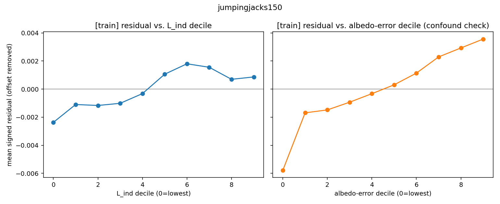
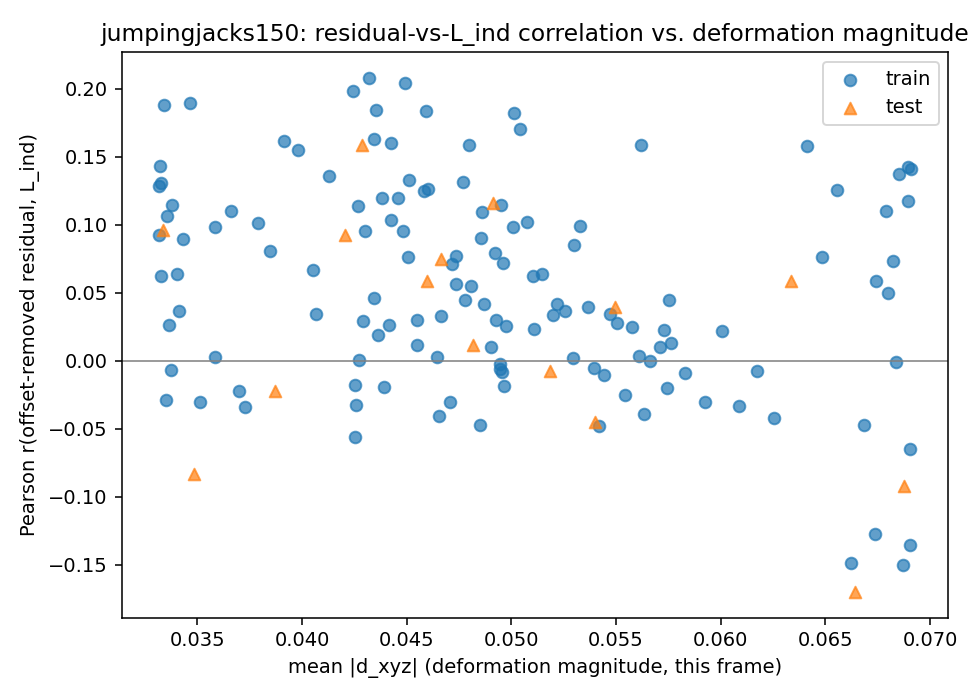
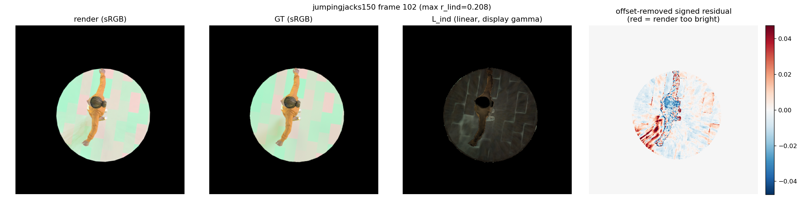
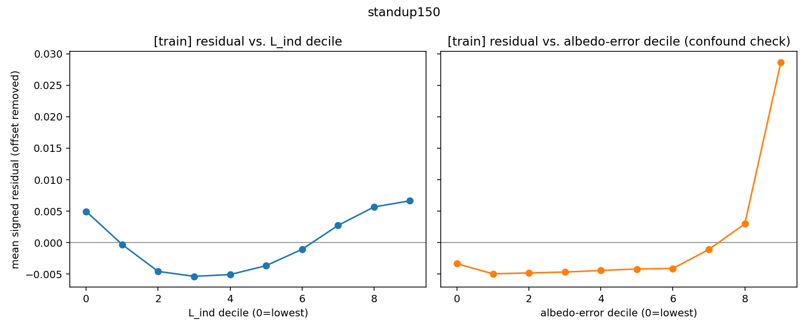
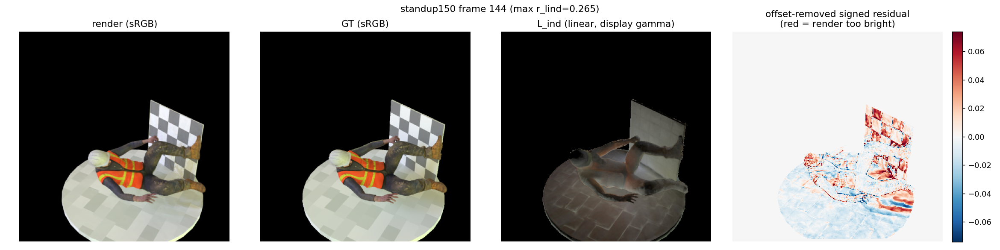

# Test 1, Probe D — deformation-correlated brightness bias in indirectly-lit regions

**Question tested:** does LumiMotion's render exhibit a signed, spatially-localized
brightness bias in regions that receive strong indirect light, and does that bias
grow with deformation magnitude — the signature predicted by the frozen-radiance
hypothesis (a deformed surfel's stale, canonical `_albedo_dc_stage1` radiance makes
it bleed too much light onto its neighbours once it's actually rotated into shadow)?

**Verdict, up front: weak, inconsistent evidence for the hypothesis's direction, no
evidence for its scaling-with-deformation prediction, and a confound (albedo
estimation error) that correlates with the render residual *more strongly* than
L_ind does in both scenes tested.** This does not refute the underlying physical
argument in CLAUDE.md — the stale-radiance mechanism is still real by construction
(see `docs/lumimotion_eval.md` §A3, A5) — but Probe D's pixel-space signature is too
weak and too confounded to serve as standalone evidence for it. Details and the
specific ways it could still be right are below; read the Limitations section before
citing any single number from this doc.

---

## Method

- **Render script**: `scripts_local/render_trajectory.py` — renders all 150 frames
  along the dataset's own camera trajectory (camera `XXXX` paired with pose `XXXX`,
  matching `r_XXXX.png`; NOT bullet-time), rebuilding the ray-tracer BVH every frame
  against that frame's own deformed geometry (`gaussians.update_bvh(...)`, mirroring
  `train_stage2.py:155-159` — the eval scripts' frame-0-only BVH bug documented in
  `docs/test1_hook_points.md` §Corrections item 3 would silently trace every later
  frame against frame-0 geometry otherwise). Uses the additive
  `dump_light_indirect=True` hook on `render_ir()` added for Probe B. Dumps per
  frame: the beauty render, a linear-space per-pixel reduction of L_ind, the
  (pipeline-scale-corrected) linear albedo, the foreground alpha mask, per-Gaussian
  `d_xyz` (half precision, for the periodicity control), and the train/test split.
- **Analysis script**: `scripts_local/analyse_probe_d.py`. GT loaded from the
  train-light folder (`chapel_day_4k_32x16_rot0`) and converted sRGB→linear; render
  also converted sRGB→linear (`render_ir.py`'s `"render"` output is sRGB-encoded).
  Foreground mask = render's own alpha (`rend_alpha > 0.5`), eroded 5px
  (`scipy.ndimage.binary_erosion`) to exclude the silhouette band. Signed error =
  `render_linear − GT_linear`, reduced to a scalar per pixel by averaging the 3
  channels (a plain channel mean, not a perceptual luminance weighting — a
  deliberately simple choice, noted as a limitation below). Per frame: **global mean
  signed error (the offset)** reported first, then the **offset-removed residual**
  is what's correlated against L_ind magnitude (also channel-mean, linear) and
  binned into deciles (pooled across all frames of a split, for statistical power).
  The same decile analysis is repeated with **GT-albedo error** (rendered vs. GT
  albedo, both linear, using the pipeline's own `albedo_scale_linear_dynamic.json`
  scale correction) as the confound check. `scripts_local/frame_stats.csv`
  (Probe B's `dump_lind.py` output) supplies the deformation-magnitude x-axis.
- **Scenes**: `jumpingjacks150_v5_spec32` and `standup150_v5_spec32`, both under
  `outputs_test1/chapelday_goldenbay/`, iteration 55000, resolution 2 — the same
  checkpoints Probe B used. **`spheres_v5_spec32` was not run: no trained checkpoint
  exists under `outputs_test1/` (only `jumpingjacks150_v5_spec32_r2_mlp` and
  `standup150_v5_spec32_r2_mlp` are present) — train one if the negative control is
  needed.**
- All 150 frames were usable for both scenes (no frame dropped for having <100
  foreground pixels after erosion).

---

## Results

### jumpingjacks150

| | |
|---|---|
| Frames analysed | 150 (135 train / 15 test) |
| Mean Pearson r(residual, L_ind) across frames | **+0.051** (std 0.077, range −0.17 to +0.21) |
| Fraction of frames with r > 0 | 72.7% |
| Mean Pearson r(residual, albedo error) across frames | **+0.288** (std 0.104) — 5.6× stronger |
| Global per-frame offset | stable, ≈ +0.029 linear, flat across all 150 frames (no visible frame-number trend) |

Pooled across all foreground pixels (train split, 4.5M px), the offset-removed
residual rises from about −0.0024 (lowest L_ind decile) to +0.0009–0.0018 through the
upper deciles — **directionally consistent** with the hypothesis (more indirect
light → render too bright), but **not monotonic**: it peaks at decile 6 and dips
slightly at deciles 8–9 rather than continuing to rise. The albedo-error confound
panel (same figure, right) shows a **cleaner, larger, near-linear** trend over the
same pixels (−0.0058 to +0.0036) — a bigger effect than L_ind's, using a predictor
that has nothing to do with indirect light.

Per-frame correlation is noisy (points scattered roughly ±0.15 around a small
positive mean) and, if anything, **trends down** with deformation magnitude across
the sequence (corr(r_lind, mean\|d_xyz\|) = **−0.31** over the 150 frames) —
opposite to the "grows with deformation" prediction.

**Qualitative check** (frame 102, the single highest-r_lind frame — i.e. the
best case the dataset offers for the hypothesis):

The strongest red band (render too bright) sits along a **background floor-pattern
edge**, not on the body. The clearest on-body feature is a **blue** patch (render
too dark) over part of the torso/arm, with thin red fringing right at the body
silhouette — more consistent with residual antialiasing/geometry-edge error
surviving the 5px erosion than with a self-occlusion indirect-light story. The
median-r_lind frame (38) looks similar: a large blue region over the torso, faint
red along floor-pattern edges, nothing that reads as "the concave underside of the
raised arm is glowing too bright."

**Controls:**
- *Minimum deformation*: the 15 lowest-`mean|d_xyz|` frames (52–65, near the mid-cycle
  quiet point) have mean\|residual\| = 0.00856 and mean r_lind = 0.083; the 15
  highest-deformation frames (135–149) have mean\|residual\| = 0.00873 (statistically
  indistinguishable) and mean r_lind = **0.014** (lower, not higher). **The bias does
  not shrink at low deformation and does not grow at high deformation** in this
  scene, by either metric.
- *Periodicity*: the closest-pose pairs found (min 15-frame gap) were (72, 87),
  (73, 88), (72, 88), all with a small pose-distance (~0.014). Their 5-bin
  residual-vs-L_ind curves correlate at r = 0.60–0.88 (moderately-to-well reproduced
  shape), but the frames' own overall r_lind values are unstable and once even flip
  sign (frame 72: −0.032 vs. frame 87: +0.042, despite near-identical body pose).
  **Caveat**: this is a real-trajectory render, so each frame pair also has a
  different camera viewpoint — this is a comparison of summary statistics, not
  pixel-registered error maps (see Limitations).

### standup150

| | |
|---|---|
| Frames analysed | 150 (135 train / 15 test) |
| Mean Pearson r(residual, L_ind) across frames | **+0.104** (std 0.104, range −0.10 to +0.27) |
| Fraction of frames with r > 0 | 75.3% |
| Mean Pearson r(residual, albedo error) across frames | **+0.404** (std 0.132) — 3.9× stronger |
| Global per-frame offset | smaller and noisier than jumpingjacks, ≈ +0.004 mean, std 0.003 |

Here the L_ind decile curve is **U-shaped, not monotonic**: it starts at +0.005
(lowest decile — wrong sign for the hypothesis), dips to about −0.005 through the
middle deciles, then rises sharply through the top three (−0.001 → +0.0027 → +0.0057
→ +0.0067). Only that top-end rise matches the predicted direction. The albedo-error
confound panel is dominated by a **single large spike at the very top decile**
(+0.029 train / +0.035 test — 4–5× the size of anything in the L_ind panel),
suggesting a small number of severely-mis-albedo'd pixels (plausibly the checkerboard
sign or a specular/thin-structure region — see the qualitative panel below) rather
than a broad spatial pattern.

Correlation with deformation magnitude across frames is flat: corr(r_lind,
mean\|d_xyz\|) = **−0.05** (no relationship, not the predicted positive trend).

**Qualitative check** (frame 144, highest r_lind = 0.265):

The dominant structure is a **top-vs-bottom split**: the checkerboard sign the
figure is holding is almost entirely red (render too bright), the floor is almost
entirely blue (render too dark), with a red/blue checkerboard-cell pattern visible
*inside* the sign itself — that cell-level alternation is a strong tell for a
material/albedo effect (the sign's checker texture), not a smooth indirect-light
gradient. This is visually the plainest illustration of the albedo confound risk in
this probe: the sign is exactly the kind of high-frequency, hard-to-fit texture that
would show up as both "high albedo error" and, incidentally, some correlation with
whatever L_ind happens to be nearby.

**Controls:**
- *Minimum deformation*: 15 lowest-deformation frames (57–71) have mean\|residual\| =
  0.0135, r_lind = 0.097; 15 highest-deformation frames (136–150, the fully-standing
  end of the monotonic crouch→stand motion) have mean\|residual\| = 0.0151 (**~12%
  higher — the one result in this probe that goes the predicted direction**) and
  r_lind = 0.101 (essentially unchanged). Weak, partial support at best — one of two
  metrics moves the predicted way, by a small margin, in one of two scenes.
- *Periodicity*: **not a meaningful control for this scene.** `standup150` is an
  explicitly monotonic crouch→stand motion (CLAUDE.md), so it has no true periodic
  recurrence; the "closest pose pairs" the search found (135↔150, 134↔150, 134↔149)
  are just adjacent frames near the flattened-out end of the motion, pushed apart by
  the 15-frame minimum gap. Their curve correlations (−0.0002, 0.67, 0.68) shouldn't
  be read as evidence either way — included for completeness, not interpreted.

---

## Confound check: is this just albedo error?

In both scenes, **GT-albedo error correlates with the render residual 4–6× more
strongly than L_ind does** (jumpingjacks: 0.288 vs. 0.051; standup: 0.404 vs. 0.104),
and its decile-binned effect size is larger too. This does not prove the L_ind
correlation is spurious — regions with poor albedo estimates (concavities, thin
structures, high-frequency textures) plausibly *coincide* spatially with regions of
strong indirect light, since both are driven by the same underlying geometric
complexity (folds, contacts, self-occlusion). The two predictors are not obviously
independent, so this comparison **cannot cleanly attribute the render-residual
pattern to one mechanism over the other** — it can only say that an ordinary,
well-known failure mode (albedo miscalibration in hard-to-fit regions) explains at
least as much of the pattern as the mechanism Probe D was designed to isolate, and
by this metric, more.

---

## What this data does and does not support

**Supports, weakly:**
- In both scenes, more frames than not (73–75%) show a positive correlation between
  L_ind and the offset-removed render residual, and the pooled top-decile L_ind bins
  are reliably brighter-than-GT in both scenes and both splits (train and test) —
  the *sign* of the effect at the high-L_ind extreme is consistent with the
  hypothesis across all 4 scene×split combinations tested.

**Does not support:**
- **The deformation-magnitude scaling prediction is not supported by either scene.**
  Per-frame r_lind vs. deformation magnitude trends *negative* in jumpingjacks
  (−0.31) and flat in standup (−0.05). The low-vs-high-deformation group comparison
  gives a small, plausibly-noise-level increase in standup (+12% mean\|residual\|)
  and no increase (actually lower r_lind) in jumpingjacks.
- **The correlation is not the dominant explanation for the render residual.** GT
  albedo error is a stronger predictor of the same residual in both scenes.
- **The decile curves are not clean monotonic dose-responses.** Jumpingjacks dips at
  the top two deciles; standup is U-shaped with the wrong sign at the low end.
- **The qualitative best-case examples do not show the predicted spatial signature**
  (a self-occluded concavity glowing too bright). Instead they're dominated by
  background-pattern edges, a top/bottom brightness split, and texture-level
  checkerboard structure on a specific prop — patterns more consistent with ordinary
  antialiasing/edge error and albedo/texture misfit than with stale-radiance bleed.

**Net reading:** Probe D finds a small, real, same-signed effect in the tails of the
L_ind distribution, present in every scene/split combination tested, but too weak,
too non-monotonic, too uncorrelated with deformation magnitude, and too dominated by
a stronger confound to stand on its own as confirmation of the frozen-radiance
hypothesis. It also doesn't refute it — CLAUDE.md's mechanism (§A2, A5 of
`docs/lumimotion_eval.md`) is established by direct code trace, independent of this
probe's pixel statistics, and a real but small effect could easily be masked by the
confounds and noise sources below. This probe should be read as "not yet
demonstrated at the pixel-statistics level," not as "disproven."

---

## Limitations (read before citing a number from this doc)

1. **Albedo/L_ind spatial confound is unresolved, not just measured.** The
   comparison above establishes that albedo error correlates more strongly with the
   residual than L_ind does; it does not (and cannot, with this design) partition
   the residual into "caused by stale radiance" vs. "caused by albedo error" where
   the two predictors themselves overlap spatially. A design that could do this
   (e.g. holding albedo error fixed and varying only L_ind, or an explicit joint/
   partial-correlation model) was out of scope here.
2. **Per-frame Pearson r is a noisy, spatially-non-independent statistic.**
   Neighbouring pixels are highly correlated (shared geometry, shared shading), so
   the effective sample size behind each frame's r is far smaller than its raw pixel
   count — the per-frame scatter (±0.15) and the sign flip in the periodicity
   control's closest pair are symptomatic of this, not necessarily of a truly
   unstable underlying effect. The pooled decile analysis (larger effective N, still
   likely inflated) is the more trustworthy of the two views used here, and even it
   is non-monotonic in both scenes.
3. **Channel-mean scalarization discards color information.** Both the residual and
   L_ind magnitude were reduced from 3 channels to 1 by a plain average, not a
   perceptual luminance weighting or a per-channel analysis. A stale-radiance error
   that's concentrated in one channel (plausible, since it's driven by a stored SH
   color) could be diluted by this choice.
4. **The periodicity control isn't pixel-registered.** Because this is a
   real-trajectory render (a deliberate choice, to match the dataset's actual
   supervision), two frames with similar body pose are viewed from different camera
   angles. "Agreement" was measured via each frame's own decile-binned curve
   (comparable regardless of viewpoint) rather than pixel-aligned error maps.
5. **5px erosion, `rend_alpha > 0.5` mask, and 5-vs-10-bin choices were not tuned or
   swept** — they're reasonable single choices, not validated against alternatives.
6. **`spheres_v5_spec32` (the negative control) was not run** — no trained checkpoint
   exists in this repo; the two scenes tested are both hypothesis-favorable
   (jointed figures with self-contact), so there's no scene in this probe where the
   hypothesis predicts *no* effect, to check the method doesn't just find spurious
   correlation everywhere.
7. **GT albedo and GT color come from the same underlying renderer/dataset**, so any
   shared bias in how the dataset was produced (rather than in LumiMotion's
   reconstruction) could in principle affect both the "render residual" and the
   "albedo error" signals similarly — not investigated here.
