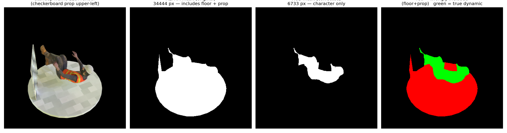
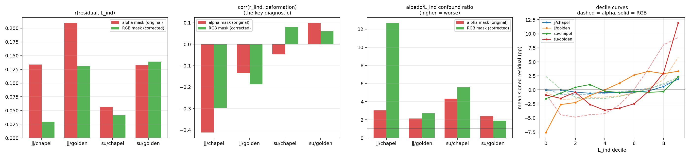

# Probe D, corrected — re-run with the RGB dynamic mask

**Why this exists.** Probe D's "dynamic-region" restriction thresholded the **alpha**
channel of `dynamic_mask/mask_XXXX.png`. Alpha is the whole-scene foreground
silhouette (IoU 0.999 against the beauty render's own alpha); **RGB** is the actual
dynamic/static segmentation (`docs/blend_files_survey.md` §1c,
`docs/indirect_fraction.md` §Correction). The restriction was therefore close to a
no-op: the pixel population was 4.4–5.3× too large and dominated by the static floor.
Probe D's central question is *deformation*-correlated error, and its deformation
restriction did nothing.

This document re-runs the full analysis with `--dynamic_mask_channel rgb`.
`docs/test1_probe_d.md` and `docs/test1_probe_d_relight.md` are left untouched.

**Verdict up front: the correction WEAKENS Probe D. Not one conclusion is
strengthened.** The headline correlation collapses in the training-light conditions,
the albedo confound gets markedly *worse*, and the single positive
deformation-scaling result the relight document reported evaporates. This is a
clean negative, and it is reported as such.

---

## Scope: which runs were actually affected

`docs/test1_probe_d.md` (the original probe) **never used the dynamic mask** — it
masked on eroded foreground alpha only. It is unaffected by this bug and is not
re-run here; it is quoted below only as context.

The bug affects `docs/test1_probe_d_relight.md`, whose four conditions all passed
`--dynamic_mask_dir`. Those are re-run, in both ε variants that document reports
(fixed ε=0.01 for its main table, scale-relative ε for its addendum), so the
comparison is like-for-like against both published tables.

**No GPU work was required and none was done.** Confirmed before starting: all four
conditions' saved per-frame dumps are on disk (150 frames each), and
`analyse_probe_d.py` contains zero references to `cuda`, `render_ir`, `GaussianModel`
or `build_bvh` — it is pure post-hoc analysis of already-rendered pixels. Only the
mask changed.

---

## The population change

| condition | alpha px/frame | RGB px/frame | ratio |
|---|---|---|---|
| jumpingjacks, chapel_day | 33,434 | 4,927 | **0.15×** |
| jumpingjacks, golden_bay | 33,434 | 4,927 | **0.15×** |
| standup, chapel_day | 38,634 | 8,106 | **0.21×** |
| standup, golden_bay | 38,634 | 8,106 | **0.21×** |

Consistent with the IoU 0.18–0.22 measured in `docs/indirect_fraction.md`. On a
representative standup frame, **80.5% of the original pixel population was floor and
prop**, not character.



All 150 frames survived in every condition (the character mask never fell below the
100-pixel floor), so no frames were dropped and the comparison is over the same
frame set.

---

## Correction to a stated finding in `test1_probe_d_relight.md`

That document states the checkerboard prop was *"now inside the dynamic mask for
standup (the prop is evidently classified as part of the dynamic Gaussian
subset)"*. **This is wrong**, and the inference behind it was wrong.

Reading the standup `.blend` directly:

```
ARMATURE_DRIVEN: Ch17_Body, Ch17_Boots, Ch17_Eyelashes, Ch17_Hair,
                 Ch17_Helmet, Ch17_Pants, Ch17_Shirt, Ch17_Vest
ALL_MESHES     : (the above) + Cube + Cylinder
```

`Cube` (the checkerboard prop) and `Cylinder` (the floor disc) carry **no Armature
modifier**. They are static. The prop was included not because it was "classified as
dynamic" but because the alpha mask was the whole foreground and included everything
opaque in frame. The corrected RGB mask **excludes it**, as the figure above confirms
(the prop is the thin panel at upper-left: present in the alpha mask, absent from the
RGB mask).

The practical consequence is the opposite of what that document assumed: it treated
the prop's texture-fit error as an unavoidable confound "inside" the dynamic region.
It is in fact removable, and is now removed.

---

## Results, side by side



Dashed/red = alpha mask (original, published). Solid/green = RGB mask (corrected).

### Diagnostic 1 — r(residual, L_ind)

| condition | ε | alpha (published) | **RGB (corrected)** | change |
|---|---|---|---|---|
| jj / chapel | fixed | +0.135 | **+0.036** | −73% |
| jj / chapel | scale | +0.134 | **+0.030** | −78% |
| jj / golden | fixed | +0.206 | **+0.140** | −32% |
| jj / golden | scale | +0.209 | **+0.131** | −37% |
| standup / chapel | fixed | +0.064 | **+0.044** | −31% |
| standup / chapel | scale | +0.056 | **+0.041** | −27% |
| standup / golden | fixed | +0.142 | **+0.153** | +8% |
| standup / golden | scale | +0.132 | **+0.139** | +5% |

**Weakened in 6 of 8 comparisons**, and the training-light jumpingjacks case — the
original probe's home ground — collapses by ~75% to a value indistinguishable from
zero.

Fraction of frames with r>0 tells the same story more starkly:

| condition | alpha | **RGB** |
|---|---|---|
| jj / chapel | 0.993 | **0.627** |
| jj / golden | 1.000 | **0.907** |
| standup / chapel | 0.887 | **0.700** |
| standup / golden | 0.620 | **0.840** |

The relight document's striking "99.3–100% of frames positive" for jumpingjacks —
presented as evidence the sign of the effect was consistent — **was a property of the
floor**, not the character. On the character alone, jumpingjacks/chapel is at 0.627,
barely better than a coin flip.

### Diagnostic 2 — correlation with deformation magnitude (the one that matters)

| condition | ε | alpha (published) | **RGB (corrected)** |
|---|---|---|---|
| jj / chapel | fixed | −0.423 | **−0.287** |
| jj / chapel | scale | −0.412 | **−0.298** |
| jj / golden | fixed | −0.143 | **−0.173** |
| jj / golden | scale | −0.135 | **−0.186** |
| standup / chapel | fixed | −0.068 | **+0.062** |
| standup / chapel | scale | −0.046 | **+0.080** |
| standup / golden | fixed | +0.099 | **+0.011** |
| standup / golden | scale | +0.099 | **+0.061** |

**This diagnostic still fails, and in one respect fails harder than before.**

- jumpingjacks remains **negative in both lighting conditions** — the wrong sign —
  and golden_bay gets *more* negative (−0.135 → −0.186).
- standup/chapel flips from −0.05 to +0.07, but that is a move between two values
  that are both indistinguishable from zero.
- **standup/golden_bay — the single positive deformation-scaling result in the entire
  investigation, which `test1_probe_d_relight.md` reported as "its one positive
  deformation-scaling result" — collapses from +0.099 to +0.011** under fixed ε.
  Under scale-relative ε it drops to +0.061. That result was substantially carried by
  the floor.

Four attempts (original Probe D, relight, relight+scale-ε, and now the corrected
mask) have now failed to show the correlation growing with deformation magnitude. The
correction removes the one weak positive rather than confirming it.

### Diagnostic 3 — L_ind decile monotonicity

Train split, scale-relative ε, values in percentage points:

| condition | mask | decile curve (0→9) | monotone steps | first decile |
|---|---|---|---|---|
| jj / chapel | alpha | +0.21, −0.78, −0.81, −0.77, −0.62, −0.34, −0.01, +0.28, +0.90, +1.95 | 7/9 | **wrong sign** |
| | **RGB** | −0.04, −0.00, −0.39, −0.60, −0.44, −0.51, −0.39, −0.17, +0.61, +1.94 | 6/9 | correct |
| jj / golden | alpha | −0.40, −1.68, −1.60, −1.39, −1.26, −1.07, −0.55, +0.35, +1.79, +5.80 | 8/9 | correct |
| | **RGB** | −7.58, −2.61, −2.25, −0.99, +0.02, +1.20, +2.66, +3.32, +2.90, +3.33 | 8/9 | correct |
| standup / chapel | alpha | +2.40, +0.16, −1.29, −1.58, −1.54, −1.16, −0.54, +0.19, +1.14, +2.22 | 6/9 | **wrong sign** |
| | **RGB** | −1.55, −0.59, +0.46, +0.96, −0.23, −0.45, −0.24, −0.44, −0.30, +2.37 | 6/9 | correct |
| standup / golden | alpha | −0.76, −4.42, −4.84, −4.40, −4.23, −2.66, +0.08, +3.89, +8.02, +9.34 | 7/9 | correct |
| | **RGB** | −0.91, −1.50, −0.42, −2.59, −3.62, −3.24, −2.47, −0.21, +3.01, +11.94 | 6/9 | correct |

**Mixed, with no clean improvement.** One genuine gain: the wrong-signed first decile
that `test1_probe_d_relight.md` flagged as a persistent problem in two conditions is
**fixed in both** — it was a floor artifact. But monotone-step counts are equal or
*worse* in three of four conditions, and the curve middles become visibly noisier
(standup/chapel now wanders +0.96 → −0.45 → −0.44 through its mid-deciles). The
jj/golden top-decile effect size *drops* from +5.80 pp to +3.33 pp, and its curve
flattens at the top rather than rising cleanly.

Net: the low end got more physical, the middle got noisier, and one top-end effect
shrank. Not a strengthening.

### Diagnostic 4 — albedo-error confound ratio

| condition | ε | alpha (published) | **RGB (corrected)** |
|---|---|---|---|
| jj / chapel | fixed | 3.00× | **10.38×** |
| jj / chapel | scale | 3.04× | **12.66×** |
| jj / golden | fixed | 2.18× | **2.58×** |
| jj / golden | scale | 2.15× | **2.71×** |
| standup / chapel | fixed | 4.47× | **7.33×** |
| standup / chapel | scale | 4.33× | **5.57×** |
| standup / golden | fixed | 2.49× | **2.27×** |
| standup / golden | scale | 2.39× | **1.91×** |

**This is the most damaging result.** The confound gets *worse* in 6 of 8
comparisons, catastrophically so at the training light: on jumpingjacks/chapel,
albedo error is now **10–13× stronger** a predictor of the render residual than
L_ind is, versus the ~3× originally reported. The mechanism is straightforward —
r_lind collapsed while r_albedo barely moved (+0.407 → +0.376), so the ratio
exploded.

The relight document's headline claim that the confound "narrows" under novel
illumination survives only in relative terms: golden_bay ratios (2.6×, 1.9–2.3×)
remain below chapel_day ratios (10–13×, 5.6–7.3×), and the narrowing is now *larger*
than reported. But the absolute picture is worse everywhere except standup/golden.

### Train / test splits

Scale-relative ε, mean r_lind:

| condition | train alpha → **RGB** | test alpha → **RGB** |
|---|---|---|
| jj / chapel | +0.136 → **+0.030** | +0.112 → **+0.028** |
| jj / golden | +0.210 → **+0.133** | +0.205 → **+0.117** |
| standup / chapel | +0.057 → **+0.037** | +0.053 → **+0.080** |
| standup / golden | +0.129 → **+0.139** | +0.165 → **+0.141** |

Train and test continue to agree closely and move together under the correction —
there is no train/test divergence, and none of the conclusions above is a split
artifact.

---

## Effect on each of Probe D's conclusions

| conclusion (as published) | effect of correction |
|---|---|
| A weak positive r(residual, L_ind) exists | **Weakened.** Collapses to +0.030 at jj/chapel (from +0.134); frames-positive falls 0.993 → 0.627. Survives only at golden_bay. |
| The signal strengthens under novel illumination | **Unchanged, and now the clearest surviving result.** golden_bay still exceeds chapel_day in every scene (jj +0.131 vs +0.030; standup +0.139 vs +0.041) — and the gap is *proportionally larger* than published. |
| Correlation grows with deformation magnitude | **Weakened.** Still fails. jumpingjacks stays negative in both lights; the one published positive (standup/golden +0.099) collapses to +0.011. |
| Decile curves are monotonic | **Mixed.** Wrong-signed first decile fixed in 2 of 2 affected conditions; monotone-step counts equal or worse in 3 of 4; one top-decile effect shrinks 5.80 → 3.33 pp. |
| The albedo confound narrows under relighting | **Directionally unchanged, absolutely worse.** Narrowing is larger than published, but chapel_day ratios blow out to 10–13×. |
| Train and test agree | **Unchanged.** |

**Nothing is strengthened. Four of six are weakened or mixed; two are unchanged.**

---

## What this means, plainly

The corrected Probe D is a **weaker, not stronger, result than published** — which is
an acceptable and informative outcome, and the one the data supports.

Three specific claims in `docs/test1_probe_d_relight.md` should now be read as
unsupported:

1. That 99–100% of jumpingjacks frames showed a positive correlation. On the
   character alone it is 63–91%, and at the training light that is near chance.
2. That standup/golden_bay showed a positive deformation-scaling correlation
   (+0.099). Corrected: +0.011.
3. That the checkerboard prop was inside the dynamic subset and therefore an
   irreducible confound. It is static, and is now excluded.

The one conclusion that genuinely survives — and is in fact *cleaner* after the
correction — is that **the L_ind correlation is consistently stronger under the
held-out light than the training light, in both scenes**. That is the compensation
hypothesis's prediction, and it is the only part of Probe D still standing. It
remains, however, subject to the confound that albedo error out-predicts L_ind by
1.9–12.7× in every condition tested.

This does not change Test 1's overall conclusion, which never rested on Probe D:
`docs/test1_conclusion.md` already characterised Probe D as weak and
confound-dominated, and the load-bearing evidence was Probe C plus the
indirect-fraction measurement. The correction makes Probe D weaker in a way that is
consistent with, and slightly reinforces, that characterisation.

---

## Limitations

1. **The corrected population is 5–7× smaller** (4,927 / 8,106 px per frame). Per-frame
   correlations are correspondingly noisier, and some of the increased scatter in the
   decile middles is attributable to that rather than to anything physical. The
   direction of the headline changes is nonetheless unambiguous and consistent across
   both ε variants.
2. **Only the mask changed.** Everything else — renders, erosion, relative-error
   metric, ε handling, decile binning — is byte-identical to the published runs, by
   design.
3. All of `docs/test1_probe_d.md`'s and `docs/test1_probe_d_relight.md`'s other
   caveats (channel-mean scalarization, spatially non-independent pixels, no
   `spheres` negative control, non-pixel-registered periodicity control) apply
   unchanged and are not repeated here.

## Reproduction

```bash
python -m scripts_local.analyse_probe_d \
  --traj_dir outputs_test1/chapelday_goldenbay/<scene>_r2_mlp/probe_d_trajectory[_relight] \
  --source_path data/d-nerf-relight-spec32/<scene> \
  --train_light_folder <chapel_day_4k_32x16_rot0|golden_bay_4k_32x16_rot330> \
  --frame_stats_csv .../probe_b_lind/cam0/frame_stats.csv \
  --erosion_px 5 --relative_error [--relative_eps 0.01 | --relative_eps_k 0.01] \
  --dynamic_mask_dir data/d-nerf-relight-spec32/<scene>/dynamic_mask \
  --dynamic_mask_channel rgb \
  --out_dir docs/test1_probe_d_corrected_assets/<scene>/<tag> --scene_label "<label>"
```

Artefacts in `docs/test1_probe_d_corrected_assets/`: per-condition `summary.json` and
plots under `jumpingjacks/` and `standup/`, plus `comparison.json`,
`comparison.png`, `mask_prop_check.png`.
