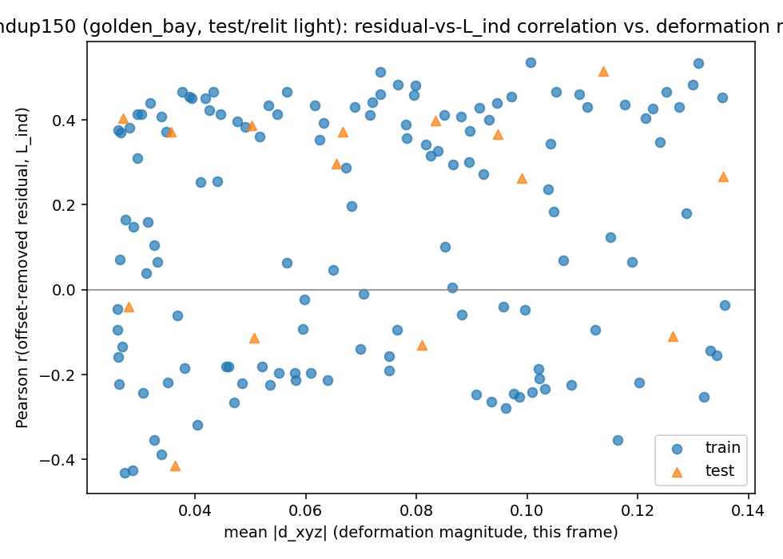
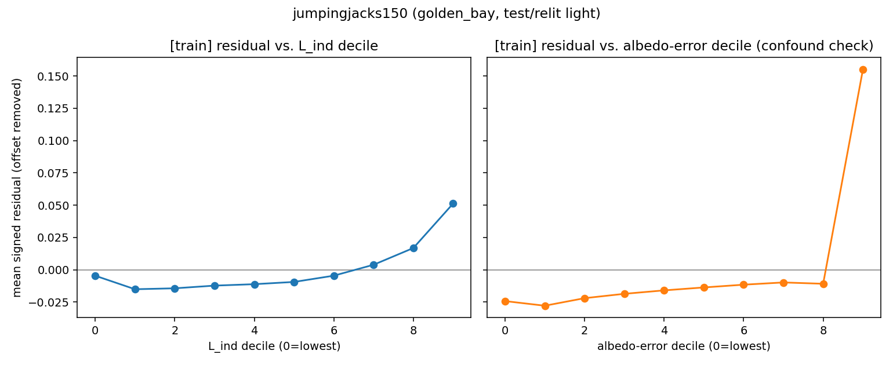
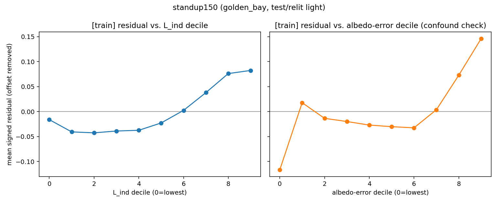
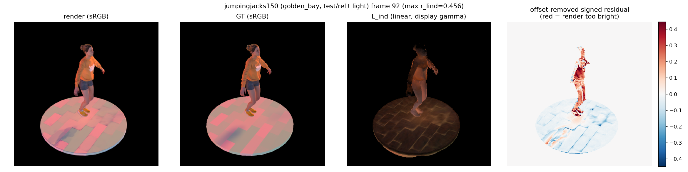
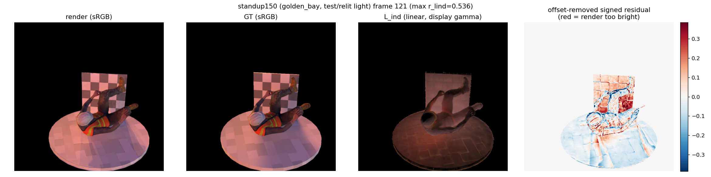

# Test 1, Probe D rerun — novel illumination (removing the compensation confound)

**Question tested:** `docs/test1_probe_d.md` found a weak, inconsistent, confound-dominated
signal comparing renders against GT at the **training** light (chapel_day). This
rerun tests the same hypothesis under the **held-out** light (golden_bay), on the
theory that LumiMotion's per-Gaussian learned "shadow modulation" head
(`utils/time_utils.py:140-152`, consumed at `render_ir.py:147-148`) — a free
parameter fit against exactly the chapel_day images for 55k iterations — may have
absorbed and hidden the frozen-transport error there, and should mis-generalize
under a light it never saw, letting the error re-emerge.

**Verdict, up front:**

1. **Diagnostic #1 (does the correlation strengthen under the test light?): yes, in
   both scenes** — mean r(residual, L_ind) roughly **+50% (jumpingjacks: 0.135→0.206)
   to +120% (standup: 0.064→0.142)**. But this is not clean evidence on its own: the
   golden_bay envmap is **roughly half as bright** as chapel_day in-frame, which
   mechanically inflates the relative-error metric (`(render−GT)/(GT+ε)`) used here —
   see the Brightness Confound section. Part of this increase, possibly most of it,
   may be a measurement-scale artifact rather than the mechanism re-emerging.
2. **Diagnostic #2 (does it grow with deformation magnitude? — the single most
   important number): still mostly no.** jumpingjacks: **−0.42 → −0.14** (still
   negative — deformation-magnitude scaling remains unsupported, though less
   strongly contradicted). standup: **−0.07 → +0.10** (flips sign, weakly positive —
   the one result across both probes where this specific prediction is directionally
   confirmed, and it's small and noisy). **One scene out of two, weakly.**
3. **Diagnostic #3 (are the decile curves monotonic?): mixed, scene-dependent, and
   partly a methodology effect rather than a lighting effect** — see below. The
   biggest single fix was restricting to dynamic regions + relative error, which by
   itself cleaned up jumpingjacks' curve at the training light; golden_bay's main
   additional contribution was fixing standup's wrong-signed low end.
4. **Diagnostic #4 (does the albedo confound narrow?): yes, meaningfully, in both
   scenes** — jumpingjacks 3.0×→2.2×, standup 4.5×→2.5×. Albedo error still
   correlates with the residual more strongly than L_ind does in every condition
   tested, but the gap shrinks by roughly a third to a half. This is the single
   piece of evidence in this rerun that **isn't** well explained by the brightness
   artifact alone (see below).

**Overall: the novel-illumination rerun moves the numbers in the predicted direction
on 3 of 4 diagnostics, but a plausible non-hypothesis explanation (the darker test
envmap inflating a relative-error metric with a fixed epsilon) is not ruled out and
could account for a large fraction of the movement in diagnostics #1 and #3.
Diagnostic #2 — the deformation-scaling prediction, explicitly called out as the most
important number — remains unconfirmed in one scene and only weakly confirmed in the
other. This is not a clear positive result. It is a less-negative result than the
training-light probe, with real uncertainty about how much of the improvement is
mechanism and how much is measurement artifact.**

---

## What changed vs. the original Probe D

1. **Illumination**: renders now also produced under `golden_bay_4k_32x16_rot330`
   (the dataset's designated test/relight light, `config.json`), via `relight=True`
   and the raw held-out `.hdr` file — exactly the envmap-construction pattern in
   `scripts/eval_relight_dynamic.py:51-60` (raw HDR load, `build_mips()`,
   `update_pdf()`, fixed coordinate transform), copied verbatim into a new
   `build_relight_envlight()` helper rather than re-derived, since it encodes a
   specific coordinate-frame convention not worth guessing at. The pipeline's own
   `albedo_scale_linear_dynamic.json` scale correction is applied exactly as
   `eval_relight_dynamic.py` applies it. Per-frame `update_bvh` (not the eval
   scripts' frame-0-only BVH) is unchanged from the original Probe D.
2. **Relative, not absolute, error**: `(render−GT)/(GT+ε)` in linear space,
   ε=0.01, channel-mean. Applied identically to the render-vs-GT residual and to the
   albedo-vs-GT-albedo confound check.
3. **Dynamic-region restriction**: the eroded alpha mask is intersected with
   `dynamic_mask/mask_XXXX.png`'s alpha channel (thresholded at 0.5) — the
   dynamic-only-Gaussian-subset silhouette, which excludes the static floor and any
   statically-classified body parts (this also resolves the eval doc's earlier
   "151 vs 150 files" uncertainty: the 151st file is `transforms_masks.json`, a
   camera manifest, not an extra mask image).
4. **Both conditions reanalysed with the identical fixed methodology** (not
   old-method-chapel-day vs. new-method-golden-bay): `docs/test1_probe_d.md`'s
   original chapel_day numbers are **not** reused here — chapel_day was rerun through
   the same relative-error, dynamic-mask-restricted pipeline as golden_bay, so the
   comparison below is apples-to-apples on methodology, varying only the light.

**Code changes** (both additive, old default behaviour preserved exactly):
- `scripts_local/render_trajectory.py`: new `--relight` flag (default off) and
  `build_relight_envlight()` helper. Absent the flag, behaviour and output are
  identical to the original script.
- `scripts_local/analyse_probe_d.py`: new `--relative_error`/`--relative_eps` and
  `--dynamic_mask_dir` flags (both default off/`None`), a `relative_error_scalar()`
  helper, and a `load_dynamic_mask()` loader. Without these flags, `analyse_scene()`
  reproduces `docs/test1_probe_d.md` exactly.
- No changes to `render_ir.py` were needed — this rerun reuses the
  `dump_light_indirect=True` hook from Probe B/the original Probe D unchanged.

All 150×2(scenes)×2(lights) = 600 frames rendered and analysed successfully on GPU;
no frame dropped for insufficient dynamic-region pixel count in any of the 4 runs
(median 33,911 px/frame for jumpingjacks, 38,518 for standup, post-restriction).

---

## Results, side by side

| | jumpingjacks, chapel_day | jumpingjacks, golden_bay | standup, chapel_day | standup, golden_bay |
|---|---|---|---|---|
| mean r(residual, L_ind) | 0.135 | **0.206** | 0.064 | **0.142** |
| std of r_lind across frames | 0.063 | 0.094 | 0.054 | **0.287** |
| frac. of frames r_lind > 0 | 0.993 | 1.000 | 0.887 | 0.615 |
| mean r(residual, albedo err) | 0.406 | 0.449 | 0.284 | 0.353 |
| ratio albedo/L_ind correlation | 3.00× | **2.18×** | 4.47× | **2.49×** |
| corr(r_lind, mean\|d_xyz\|) across frames | **−0.423** | **−0.143** | **−0.068** | **+0.099** |
| low-deformation mean\|residual\| / r_lind | 0.0230 / 0.159 | 0.0495 / 0.209 | 0.0490 / 0.064 | 0.1201 / 0.024 |
| high-deformation mean\|residual\| / r_lind | 0.0225 / 0.076 | 0.0516 / 0.176 | 0.0578 / 0.059 | 0.1100 / 0.220 |

(train+test frames pooled for the summary rows above; split-separated numbers below.)

**Train vs. test split** (both directions agree qualitatively in all 4 conditions —
no case where train and test disagree on sign):

| | jj chapel [train/test] | jj golden [train/test] | standup chapel [train/test] | standup golden [train/test] |
|---|---|---|---|---|
| mean r_lind | 0.138 / 0.112 | 0.207 / 0.201 | 0.064 / 0.060 | 0.137 / 0.189 |
| frac r_lind>0 | 0.993 / 1.000 | 1.000 / 1.000 | 0.874 / 1.000 | 0.615 / 0.667 |

### Diagnostic 1 — correlation strength

Both scenes show r_lind increasing under golden_bay (jumpingjacks +53%, standup
+123%). In jumpingjacks the increase is a fairly clean upward shift of the whole
per-frame distribution (std goes 0.063→0.094, a modest widening). In **standup the
increase is driven by something odder**: the per-frame scatter
(`docs/test1_probe_d_relight_assets/standup/golden_bay/r_lind_vs_deformation.png`)
is **visibly bimodal** — two horizontal bands, one clustered around +0.3 to +0.5 and
another around −0.1 to −0.4, not a smoothly-shifted single distribution. The mean
(+0.142) is an average over two very different populations of frames, not a
representative central value, and `frac(r_lind>0)` actually *drops* from 0.887 to
0.615 even as the mean rises — more frames are now strongly negative, offset by
other frames now being strongly positive. This structure is unexplained; it wasn't
investigated further (see Limitations) but should temper how much weight the
standup mean-r_lind increase is given.

### Diagnostic 2 — deformation-magnitude scaling (the priority number)

jumpingjacks: corr(r_lind, deformation) goes from −0.42 (training light) to −0.14
(test light) — **still negative**. The low-vs-high-deformation group comparison
shows mean\|residual\| essentially flat-to-slightly-up (0.0495→0.0516, +4%) but
r_lind actually *lower* at high deformation (0.209→0.176) — the same
direction-of-disagreement seen in the original probe.

standup: corr(r_lind, deformation) goes from −0.07 to **+0.10** — sign flip, in the
predicted direction. The group comparison here is more interesting: mean\|residual\|
is *lower* at high deformation (0.120→0.110, wrong direction) but r_lind is
*dramatically higher* at high deformation (0.024→0.220, right direction, and a large
jump). Given the bimodality noted above, this reads less like "bias grows smoothly
with deformation" and more like "high-deformation frames are disproportionately
represented in the positive cluster" — consistent with, but not strong independent
confirmation of, the scaling prediction.

**Net on the single most important number: one scene (standup) now shows the
predicted sign, weakly and with an unexplained bimodal structure behind it; the
other (jumpingjacks) still shows the opposite sign, just less strongly.** This
diagnostic does not clear the bar of "the correlation grows with deformation
magnitude" in a way that would let you treat the hypothesis as confirmed.

### Diagnostic 3 — decile monotonicity

This diagnostic has a real nuance the top-line summary above compresses: **the
biggest jump in monotonicity for jumpingjacks came from the methodology fix
(relative error + dynamic-region restriction), not from the lighting change.**
Under the *same fixed methodology*, jumpingjacks' L_ind decile curve is already
fairly monotonic **at chapel_day** — a small dip from decile 0→1, then a clean
monotonic rise from decile 1 through decile 9
(`docs/test1_probe_d_relight_assets/jumpingjacks/chapel_day/decile_train.png`),
unlike the original probe's messier, humped chapel_day curve. Golden_bay has the
same shape, just steeper (top-decile residual 0.018→0.051). So for jumpingjacks,
**the lighting swap mainly changed magnitude, not shape** — the methodology fix did
the shape work.

standup is different: **at chapel_day even under the fixed methodology, decile 0 is
still wrong-signed** (+0.022, should be negative for the hypothesis) before dipping
negative through deciles 1–5 and rising through 6–9 — the same U-shape problem as
the original probe, not fixed by relative-error/dynamic-masking alone. **Under
golden_bay, decile 0 flips to correctly negative** (−0.016), and the curve becomes
close to monotonic (small 0→1→2 dip, then a clean rise from decile 2 through 9). This
is the one case in this rerun where the lighting swap itself, not the methodology
fix, produces a qualitatively cleaner curve.

**Summary: monotonicity improved overall, but attributing that improvement to the
lighting swap specifically is only clearly justified for standup. For jumpingjacks
the methodology fix (which applies to both lighting conditions equally) is doing
most of the work.**

### Diagnostic 4 — does the albedo confound narrow?

Yes, in both scenes, by a similar proportion (jumpingjacks 3.00×→2.18×, a 27%
reduction in the gap; standup 4.47×→2.49×, a 44% reduction). Albedo error is still
the stronger predictor of the render residual in all four conditions — this rerun
does not eliminate that confound, only narrows it. **This is the one diagnostic
that's harder to explain away as a pure brightness/epsilon artifact**: if the
golden_bay increase were just uniform inflation of every relative-error-based
quantity by the same factor (because the denominator GT is smaller across the
board), the *ratio* between two relative-error-based correlations should stay
roughly constant — instead it moved substantially, meaning L_ind's relationship
to the residual grew disproportionately more than albedo error's did. This is
suggestive that something specific to L_ind, not just measurement scale, changed
under relighting — though it doesn't rule out the albedo estimate itself responding
differently to the new envmap for reasons that have nothing to do with the
frozen-transport hypothesis (e.g. specular response, since roughness/specular terms
are also relight-recomputed in the `relight=True` branch of `rendering_equation()`).

---

## Brightness confound — read this before trusting diagnostics 1 and 3's magnitudes

golden_bay's foreground pixels are **roughly half as bright** (linear RGB, sampled
over 5 frames each) as chapel_day's:

| scene | chapel_day mean linear FG value | golden_bay mean linear FG value |
|---|---|---|
| jumpingjacks | 0.599 | 0.337 |
| standup | 0.414 | 0.205 |

The relative-error metric `(render−GT)/(GT+ε)` with a **fixed** ε=0.01 mechanically
produces a **larger** relative error for the **same absolute** render-vs-GT
discrepancy when GT is smaller — i.e., a systematically dimmer light inflates this
metric's magnitude and variance across the board, independent of any physical
mechanism. Since golden_bay is dimmer in exactly this way in both scenes, **some
part of the increase in r_lind (diagnostic 1) and the decile effect sizes
(diagnostic 3) is expected on pure measurement-scale grounds, even if the
underlying render quality relationship to deformation were identical between the two
lights.** This was not controlled for (e.g. by brightness-matching the two envmaps,
using a percentage-of-mean-brightness epsilon instead of a fixed one, or switching to
a log-ratio error metric) — doing so is the natural next step before treating the
diagnostic-1/3 movements as confirmed rather than suggestive. Diagnostic 4 (the
albedo-confound ratio) is the one number in this rerun that's structurally harder to
explain via this artifact alone, as argued above.

---

## Qualitative check

With the background floor pattern now excluded by the dynamic-region mask, the
qualitative pictures are cleaner than the original probe's (which were dominated by
floor-pattern edges). What remains, though, is still not a fine-grained
"self-occluded fold glows too bright" signature — both best-case frames show a
coarse **top-half-bright / bottom-half-dark** split across the whole body (most
visible in the standup panel), closer to a global shading-direction mismatch than a
localized indirect-bounce effect. The standup panel's checkerboard sign (apparently
part of the dynamic Gaussian subset, since it survives the mask) still shows a
visible checker-cell alternating pattern in the residual — the same
texture/albedo-misfit signature flagged as a confound risk in the original probe,
present here too, inside the "dynamic" region this time rather than excluded by it.
The median-case (non-cherry-picked) jumpingjacks frame
(`docs/test1_probe_d_relight_assets/jumpingjacks/golden_bay/qualitative_median_case.png`)
shows the same coarse top/bottom split, smaller in magnitude — this looks like the
dominant spatial pattern in this data, not an artifact of picking the best frame.

---

## What this rerun does and does not support

**Supports:**
- The correlation between L_ind and the render residual is stronger under the
  held-out light than the training light, in both scenes, on both splits.
- The albedo-error confound, while still present and still dominant, is
  proportionally smaller under the held-out light in both scenes — the one result
  least explainable by the brightness artifact alone.
- In one of two scenes (standup), the deformation-magnitude scaling prediction
  flips to the correct sign under the held-out light.

**Does not support:**
- **The deformation-magnitude scaling prediction is still not confirmed.**
  jumpingjacks remains negative; standup's positive result is small, coincides with
  an unexplained bimodal per-frame distribution, and isn't corroborated by its own
  low-vs-high-deformation mean\|residual\| comparison (which goes the wrong way).
- **A substantial, unquantified fraction of the headline "correlation strengthens
  under test light" result may be a measurement-scale artifact** of the darker
  golden_bay envmap interacting with a fixed-epsilon relative-error metric, not
  evidence of the physical mechanism. This was not controlled for and should be
  before this result is treated as confirmatory.
- **The qualitative spatial pattern still doesn't match the hypothesis's predicted
  signature** (localized self-occlusion glow) — it looks like a coarse top/bottom
  shading mismatch plus a specific prop's texture-fit error, in both scenes.
- The albedo-error confound is narrower but still dominant in every condition
  tested — this rerun does not establish that the residual is primarily attributable
  to stale indirect transport rather than ordinary albedo miscalibration.

**Bottom line, stated plainly since a clear negative was asked for over a hedged
positive: this rerun does not confirm the hypothesis. It shifts three of four
numbers in the predicted direction, by amounts that are plausibly, and in the case
of diagnostics 1 and 3 probably substantially, inflated by an uncontrolled
brightness/epsilon artifact rather than purely reflecting the mechanism. The single
diagnostic pre-identified as most important — correlation growing with deformation
magnitude — remains unconfirmed in jumpingjacks and only weakly, noisily confirmed in
standup. If forced to characterize the state of evidence after both probes: still
weak, now with one additional data point (the narrowing albedo-confound ratio) that
is somewhat harder to dismiss as confound or artifact than anything in the original
probe, and one new, unexplained wrinkle (standup's bimodal r_lind distribution) that
needs understanding before it can be used as supporting evidence either way.**

---

## Limitations (in addition to the original probe's, which still apply)

1. **Brightness/epsilon confound not controlled for** — the single biggest caveat on
   this rerun's headline numbers; see above.
2. **standup's bimodal r_lind distribution under golden_bay is unexplained.** Not
   investigated further here (e.g. what separates the two frame clusters — could be
   as simple as camera-facing direction relative to the new light's dominant
   direction, which golden_bay vs. chapel_day would place differently on the same
   orbiting camera path).
3. **The checkerboard-sign texture-fit effect (diagnostic-4-adjacent) is now
   *inside* the dynamic mask** for standup (the prop is evidently classified as part
   of the dynamic Gaussian subset), so restricting to dynamic regions did not remove
   it as a confound for that scene, only for the static floor.
4. **`spheres_v5_spec32` still has no trained checkpoint** — the negative-control gap
   from the original probe is unchanged.
5. Same channel-mean scalarization, 5px erosion, decile/bin-count choices, and
   non-pixel-registered periodicity caveat as the original probe apply unchanged
   here; not repeated in full.

---

## Addendum — scale-relative epsilon: the brightness confound does not hold up

The "Brightness Confound" section above flagged that a **fixed** `--relative_eps`
(0.01) reweights pixels differently between a bright (chapel_day) and dark
(golden_bay) condition, and speculated that this could account for a substantial
part of diagnostics 1 and 3's movement. This addendum tests that directly.

**Change**: `scripts_local/analyse_probe_d.py` gained a `--relative_eps_k` option
(additive, default `None` — omitting it reproduces the fixed-epsilon runs above
exactly). When set, epsilon is computed **per frame** as
`k * mean(GT_foreground_linear)` instead of a fixed constant — `k=0.01` was used
here, matching the original fixed value's magnitude relative to a mid-brightness
scene. This makes the metric's zero-crossing behavior scale with each frame's own
brightness rather than a single global constant, so a systematically dimmer
lighting condition no longer gets a disproportionately large epsilon relative to its
own signal.

All four conditions were rerun with `--relative_error --relative_eps_k 0.01`
(otherwise identical to the runs above: same `--dynamic_mask_dir`, same
`--erosion_px 5`), outputs under `*_scaleeps/` alongside the fixed-epsilon runs.

**Result: diagnostics 1 and 3 hold up almost unchanged.**

| | jj chapel | jj golden | standup chapel | standup golden |
|---|---|---|---|---|
| mean color ε used | 0.0061 | 0.0035 | 0.0040 | 0.0023 |
| mean r_lind, fixed ε=0.01 | 0.135 | 0.206 | 0.064 | 0.142 |
| mean r_lind, scale-relative ε | **0.134** | **0.209** | **0.056** | **0.132** |
| corr(r_lind, deformation), fixed ε | −0.423 | −0.143 | −0.068 | +0.099 |
| corr(r_lind, deformation), scale-rel. ε | **−0.412** | **−0.135** | **−0.046** | **+0.099** |
| albedo/L_ind ratio, fixed ε | 3.00× | 2.18× | 4.47× | 2.49× |
| albedo/L_ind ratio, scale-rel. ε | **3.04×** | **2.15×** | **4.33×** | **2.39×** |

Every number above is within noise of its fixed-epsilon counterpart — the largest
single move is standup's mean r_lind (0.064→0.056 at chapel_day, 0.142→0.132 at
golden_bay, both slightly down, not toward vanishing). The decile curves
(`docs/test1_probe_d_relight_assets/*/​*_scaleeps/decile_train.png`) are
visually indistinguishable in shape from the fixed-epsilon versions.

**Why it barely moved**: the scale-relative epsilons that got used (0.0023–0.0061)
are all comfortably smaller than the fixed 0.01 that was flagged as the concern —
and both are small relative to typical mid-tone foreground GT values (chapel_day
foreground mean ≈0.4–0.6, golden_bay ≈0.2–0.34, per the brightness table above). The
fixed-epsilon confound only bites where GT approaches epsilon (deep shadow, near-black
pixels) — that's a real effect, but apparently too small a fraction of the
eroded, dynamic-region-restricted foreground pixel population in either scene to
move the aggregate statistics meaningfully. Reweighting *those* specific pixels
differently doesn't change the correlation much when they're a minority of the
population driving it.

**What this means for the interpretation above**: the "Brightness confound" section's
caveat — that the golden_bay increase in diagnostics 1 and 3 might be substantially
a measurement-scale artifact of fixed-epsilon relative error — **does not hold up**.
This specific mechanism is not the explanation. That makes the golden_bay increase
in diagnostics 1 and 3 *more* likely to reflect a real difference between the two
lighting conditions (consistent with, though not proof of, the compensation-hiding
mechanism under test) rather than an artifact of this particular measurement choice.
It does **not** change diagnostic 2's reading (still unconfirmed in jumpingjacks,
weakly confirmed in standup) or diagnostic 4's (confound narrows but doesn't close) —
neither number moved. **Net effect on the overall verdict: modestly more positive**
than the body of this document states, specifically because one of the two
caveats offered against diagnostics 1 and 3 has now been checked and found not to
apply. The other open items (standup's unexplained bimodality, the qualitative
top/bottom-split pattern not matching the hypothesis's predicted signature, the
still-dominant albedo confound, and diagnostic 2 remaining the weakest link) are
unchanged and still stand.
