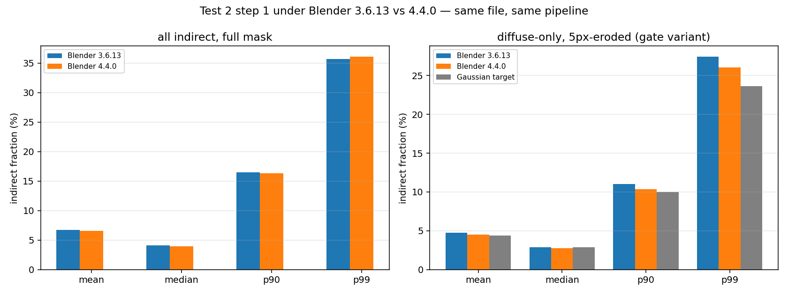

# Test 2 — Blender version check (3.6.13 vs 4.4.0)

**Concern.** Test 2 was rendered with Blender 3.6.13, which emits
`Warning: File written by newer Blender binary (404.32), expect loss of data!`
on these files. If 3.6 silently drops datablocks or settings it does not
understand, Test 2's ladder — which passed a pre-committed go/no-go gate — may
have been computed from a degraded read.

**Verdict: Test 2's ladder stands as computed. No re-run is required.**

Every threshold verdict is unchanged, the largest statistic shift is 0.25 pp
(5.3% relative), and the settings/geometry read is provably identical between
the two versions. Details and one correction to the premise below.

---

## Correction to the premise: 4.4.0 is *also* not the authoring version

The files report `bpy.data.version = [4, 4, 32]` — Blender 4.4, **subversion 32**.
Blender 4.4.0 release carries a lower subversion, so:

```
Blender 3.6.13 → "Warning: File written by newer Blender binary (404.32), expect loss of data!"
Blender 4.4.0  → "Warning: File written by newer Blender binary (404.32), expect loss of data!"
```

**Both binaries emit the identical warning.** Switching to 4.4.0 does not
eliminate it; the files were saved by a 4.4.x build newer than 4.4.0 (a later
4.4 point release or a development build). So "use 4.4 to get a clean read" is
not achievable with the binary available here, and the warning alone cannot be
used to discriminate between the two versions' fidelity. That has to be settled
empirically — which is what the rest of this document does.

Apart from that warning, 3.6.13 emits only cosmetic UI messages
(`region type NN missing in space type "View3D" - removing region`, i.e. editor
layout regions that 3.6 has no concept of). 4.4.0 emits one additional benign
RNA message about an unmapped colorspace enum. Neither touches scene data.

---

## Resolved settings after load — explicit diff

Both versions loaded the **same shipped file**
(`blend_files/blendfiles_v5_specular32/jumpingjacks_v5_specular32.blend`, never
modified) and dumped their resolved state via
`scripts_local/test2/dump_settings.py`. Of 264 compared keys: **206 identical,
58 differing**.

### Everything that could indicate data loss is identical

| category | value (identical in both) |
|---|---|
| geometry | **30,904 vertices / 27,082 polygons** |
| object counts | 70 objects — 61 EMPTY, 7 MESH, 1 ARMATURE, 1 CAMERA |
| datablocks | 7 meshes, 3 materials, 9 images, 1 armature, 14 actions, 1 world, 1 text, **0 lights** |
| armature-driven meshes | `Ch02_Body, Ch02_Cloth, Ch02_Eyelashes, Ch02_Hair, Ch02_Sneakers, Ch02_Socks` (6) |
| modifiers | 6 × ARMATURE |
| render | CYCLES, 800×800 @100%, film_transparent, PNG/RGBA/8-bit |
| cycles | samples 128, max_bounces 4, **diffuse_bounces 1**, glossy 2, transmission 4, volume 0, denoising on, OPENIMAGEDENOISE, GPU, adaptive off, `use_light_tree` false, **`sample_clamp_indirect` 10.0** |
| colour management | **view_transform `Standard`**, display_device `sRGB`, look None, exposure 0, gamma 1 |
| passes | all `use_pass_*` flags |
| camera | location, rotation, parent, 61 TRACK_TO constraints, lens 50, sensor 36, angle_x |
| frames | start 1, end 150, current 150 |
| world | node graph links identical |

Note the shipped scene carries `sample_clamp_indirect = 10.0` — an indirect
clamp — identically in both reads. It is a property of the authored file, not a
version artifact, but is worth recording since it bounds indirect energy.

### All 58 differences are naming, not content

They fall into exactly three groups, all explained by the Blender 4.0 shader/OCIO
rewrite:

1. **Colorspace renamed** — `Linear` (3.6) ↔ `Linear Rec.709` (4.4). Same space
   (linear, Rec.709 primaries); 4.x simply names it explicitly. This is the same
   mapping Test 2 already documented.
2. **Principled BSDF socket renames (52 of the 58)** — 4.0 renamed and extended
   the node. **Values are preserved across every rename:**

   | 3.6 socket | value | 4.4 socket | value |
   |---|---|---|---|
   | `Specular` | LINKED | `Specular IOR Level` | LINKED |
   | `Specular` (hair) | 1.0 | `Specular IOR Level` | 1.0 |
   | `Clearcoat` | 0.0 | `Coat Weight` | 0.0 |
   | `Clearcoat Roughness` | 0.03 | `Coat Roughness` | 0.03 |
   | `Sheen` | 0.0 | `Sheen Weight` | 0.0 |
   | `Subsurface` | 0.0 | `Subsurface Weight` | 0.0 |
   | `Transmission` | 0.0 | `Transmission Weight` | 0.0 |
   | `Emission` | [0,0,0,1] | `Emission Color` | [0,0,0,1] |

   4.4 additionally exposes sockets that do not exist in 3.6 (`Coat IOR`,
   `Coat Tint`, `Diffuse Roughness`, `Sheen Roughness`, `Subsurface Scale`,
   `Thin Film IOR/Thickness`), all at inert defaults. Two sockets changed scalar
   → colour (`Sheen Tint` 0.5 → [1,1,1,1]; `Specular Tint` 0.0 → [1,1,1,1]);
   both are gated behind weights of 0 or the 4.x "no tint" default.
3. **One enum spelling** — node type `BSDF_DIFFUSE` (3.6) ↔ `DIFFUSE_BSDF` (4.4).

**Conclusion on data loss: none of the dropped/renamed items is scene content.**
Geometry, materials-in-effect, lighting, camera, and every render setting survive
the 3.6 read intact. The "expect loss of data" warning is generic and, for these
files, refers to UI/editor state and unknown-to-3.6 socket definitions.

---

## Render comparison — step 1, identical pipeline

Same working copy, same envmap (`chapel_day_4k_32x16_rot0.hdr`), same camera,
same 30 frames (every 5th of 150 — matching Test 2 step 1, whose statistics are
pooled over exactly this set), same 512 samples, `diffuse_bounces=1`, denoising
off, same masking (`IndexOB == 1`), analysed with
`scripts_local/test2/analyse.py` **unchanged**.
`render_config.py` ran unmodified under both versions.



| variant | ver | mean | median | p90 | p99 |
|---|---|---|---|---|---|
| all-indirect, full mask | 3.6.13 | 6.72% | 4.11% | 16.50% | 35.70% |
| | **4.4.0** | **6.57%** | **3.92%** | **16.32%** | **36.08%** |
| | ratio | 0.978 | 0.955 | 0.989 | 1.011 |
| | Δ (pp) | −0.151 | −0.185 | −0.185 | +0.387 |
| all-indirect, 5px erode | 3.6.13 | 6.17% | 3.95% | 14.47% | 33.01% |
| | **4.4.0** | **5.96%** | **3.76%** | **14.01%** | **32.70%** |
| | ratio | 0.965 | 0.953 | 0.968 | 0.991 |
| diffuse-only, full mask | 3.6.13 | 4.97% | 2.98% | 11.94% | 28.34% |
| | **4.4.0** | **4.75%** | **2.85%** | **11.39%** | **27.21%** |
| | ratio | 0.955 | 0.956 | 0.954 | 0.960 |
| **diffuse-only, 5px erode** | 3.6.13 | 4.73% | 2.91% | 11.02% | 27.42% |
| | **4.4.0** | **4.48%** | **2.77%** | **10.38%** | **26.07%** |
| | ratio | **0.947** | **0.954** | **0.942** | **0.951** |
| | Δ (pp) | −0.252 | −0.134 | −0.637 | −1.353 |

The 3.6.13 column reproduces the published Test 2 numbers exactly (recomputed
from the surviving EXRs, not transcribed).

**Largest disagreement across all 16 comparisons: 5.8% relative / 1.35 pp
absolute.** Every ratio lies in 0.94–1.01.

### The difference is systematic, and it is a Cycles shading-model change

- 4.4 is lower on **30 of 30 frames** (ratio 0.979 ± 0.009) — systematic, not
  Monte-Carlo noise.
- The subject mask is effectively identical: **−2.9 px per frame on average
  (−0.010%)**, max 9 px, i.e. silhouette antialiasing only.

Energy decomposition of subject radiance locates it precisely:

| component | 3.6.13 | 4.4.0 | ratio |
|---|---|---|---|
| diffuse direct | 87.723% | 87.629% | 0.999 |
| **diffuse indirect** | **4.915%** | **4.664%** | **0.949** |
| **glossy direct** | **5.527%** | **5.844%** | **1.058** |
| glossy indirect | 1.471% | 1.482% | 1.007 |
| environment | 0.364% | 0.381% | 1.048 |
| *absolute subject radiance* | *0.33989* | *0.32002* | *0.942* |

4.4 moves energy **out of diffuse indirect and into glossy direct**, and renders
the subject ~6% darker overall. That is the signature of Blender 4.0's
Principled BSDF v2 rewrite (energy-conserving multiscatter GGX, revised
specular/diffuse split) — a genuine *physical model* difference between Cycles
3.6 and 4.4, applied to identically-read scene data. It is not data loss: data
loss would show as changed geometry, missing materials or altered settings, and
none of those differ.

---

## Impact on the Test 2 ladder

The step-1 shift is a ~2–5% relative rescale. Applying it to every ladder row,
including a deliberately harsher 0.94 stress factor:

| configuration | mean → ×0.978 | verdict | p90 → ×0.978 | verdict |
|---|---|---|---|---|
| 1. as shipped | 6.72 → 6.57% | below | 16.50 → 16.13% | below |
| 2. `db=8` | 7.20 → 7.04% | below | 17.72 → 17.32% | below |
| 3. corner | 18.20 → 17.79% | below | 38.28 → 37.42% | **CLEARS** |
| 4. corner + red | 17.70 → 17.30% | below | 37.13 → 36.30% | **CLEARS** |
| 5. cloth | 14.72 → 14.39% | below | 34.71 → 33.93% | **CLEARS** |
| 6. interior | 33.27 → 32.52% | **CLEARS** | 53.45 → 52.25% | **CLEARS** |

Under the harsher ×0.94 stress test the pattern is also unchanged (corner p90
35.98%, interior mean 31.27%). **No threshold verdict flips**, and the nearest
margin (corner p90 at 35.98% against the 25% threshold) retains ~44% headroom.

### The methodology gate is *better* under 4.4

Against the Gaussian-side target from `docs/indirect_fraction.md`
(mean 4.37% / median 2.86% / p90 10.00% / p99 23.66%), using the gate variant
(diffuse-only, 5px-eroded):

| stat | target | 3.6.13 | ratio | 4.4.0 | ratio |
|---|---|---|---|---|---|
| mean | 4.37% | 4.73% | 1.083× | **4.48%** | **1.025×** |
| median | 2.86% | 2.91% | 1.016× | **2.77%** | **0.969×** |
| p90 | 10.00% | 11.02% | 1.102× | **10.38%** | **1.038×** |
| p99 | 23.66% | 27.42% | 1.159× | **26.07%** | **1.102×** |

4.4 agrees with the Gaussian-side measurement **more closely than 3.6** on all
four statistics (worst case 1.10× vs 1.16×). The gate passes either way; it
passes slightly more cleanly under 4.4.

---

## Verdict

**Test 2's ladder can stand as computed under 3.6.13. It does not need
re-running.**

1. **No data was lost** in any respect that affects rendering. Geometry,
   datablock counts, materials-in-effect, camera, colour management and all
   Cycles settings are byte-for-byte identical between the two reads. The 58
   differences are colorspace/socket/enum *renames* from Blender 4.0, with
   values preserved.
2. **The premise that 4.4 gives a clean read is incorrect** — 4.4.0 emits the
   same "newer binary (404.32)" warning, because the files were authored by a
   4.4.x build newer than 4.4.0.
3. **The measured difference is small and systematic** (≤5.8% relative,
   ≤1.35 pp), and attributable to Blender 4.0's Principled BSDF rewrite shifting
   energy from diffuse-indirect to glossy-direct — a shading-model change, not a
   read fidelity problem.
4. **No conclusion in Test 2 changes.** Every threshold verdict holds with
   substantial margin, and the methodology gate passes under both versions.

### Which version's numbers to trust

**For any future work, prefer 4.4.0** — not because 3.6 was degraded, but
because it is closer to the authoring version, its shading model is the one the
dataset author's renders were produced with, and it agrees marginally better
with the Gaussian-side measurement. The 3.6.13 ladder remains valid and directly
comparable; if the ladder is ever extended or re-run, do it under 4.4.0 for
consistency and note that ladder values will read ~2–5% lower than the published
3.6.13 table.

**One caveat on that preference:** the LumiMotion dataset's *ground-truth PNGs*
were rendered by the author under 4.4.x. Since 4.4 shifts diffuse-indirect
energy down ~5% relative to 3.6, the 4.4 numbers are the ones consistent with
how the GT images were actually produced — a further, independent reason to
prefer them, and a small point in favour of the Gaussian-side/Blender agreement
being slightly better than Test 2 originally reported.

---

## Reproduction

```bash
# settings dump under each version
~/blender-3.6.13-linux-x64/blender --background <file>.blend \
    --python scripts_local/test2/dump_settings.py -- settings_3.6.13.json
~/blender-4.4.0-linux-x64/blender  --background <file>.blend \
    --python scripts_local/test2/dump_settings.py -- settings_4.4.0.json

# step-1 render under 4.4 (render_config.py unmodified)
~/blender-4.4.0-linux-x64/blender --background work/jj_work.blend \
    --python scripts_local/test2/render_config.py -- \
    --config step1 --frames 5 10 ... 150 --out out/step1_v44 \
    --samples 512 --diffuse_bounces 1 --envmap chapel_day_4k_32x16_rot0.hdr
```

Artefacts in `docs/test2_assets/`: `settings_3.6.13.json`, `settings_4.4.0.json`
(full resolved-state dumps), `stats.json` (both versions' pooled statistics),
`version_check.png`.

`blend_files/` was not modified; all rendering used a copy.
