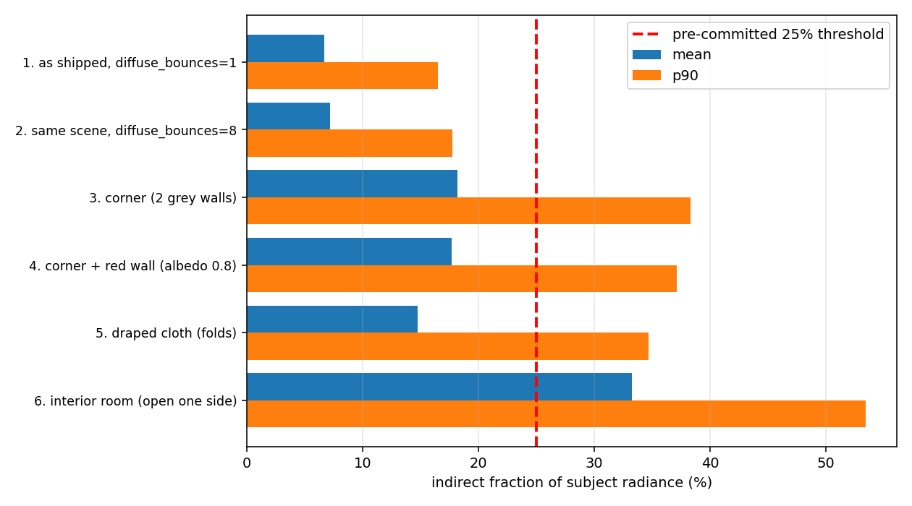
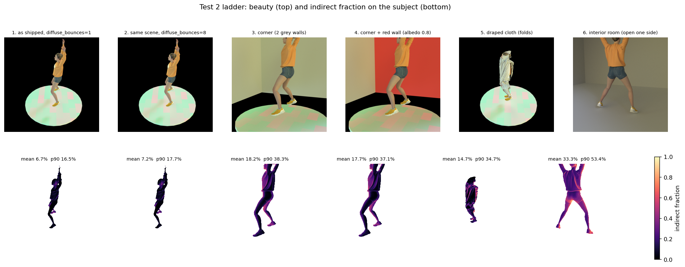

# Test 2 — indirect-illumination fraction across scene configurations

**Purpose.** Test 1 established that LumiMotion's frozen-transport error is real but
its render effect is negligible *in the benchmark scenes*, because indirect light is
only a small fraction of those images. Implied render error scales linearly with
indirect fraction. Pre-committed decision rule (`docs/test1_conclusion.md` §5): if no
realistic configuration exceeds **~25% indirect fraction**, the effect is marginal
everywhere and the direction is abandoned.

---

## Verdict

**The threshold is met. The direction should not be abandoned.**

- On **p90**, four of six configurations clear 25%: corner **38.3%**, corner+red
  **37.1%**, cloth **34.7%**, interior **53.5%**.
- On **mean**, one configuration clears: interior **33.3%**. Corner (18.2%), cloth
  (14.7%) and the shipped scene (6.7%) do not.

Per the brief's own criterion — *"a configuration with a moderate mean but a high p90
is a positive result, because contact regions are precisely where the effect lives"* —
this is a positive result, and the interior case is positive on the stricter test too.

The measurement is well-validated: the reconstruction is exact on interior pixels
(0.0002% discrepancy), the tails are stable to within 0.4 pp across a 16× sample-count
sweep, and step 1 reproduces the Gaussian-side number to within 2–16% on all four
statistics.

**Caveat that matters for the decision.** Clearing the fraction threshold is necessary,
not sufficient. The implied *render* error only exceeds the reconstruction noise floor
robustly in the interior configuration, and then mainly under `standup`-like
deformation. See "Implied render error", and the open risk restated at the end.



---

## Step 1 — methodology gate: **PASSED**

Blender's total indirect on the shipped scene reads ~1.5× the Gaussian-side figure.
That gap is fully explained, and once the definitions are matched the two agree
closely.

| variant | mean | median | p90 | p99 |
|---|---|---|---|---|
| **Gaussian target** (`indirect_fraction.md`, RGB mask) | **4.37%** | **2.86%** | **10.00%** | **23.66%** |
| Blender, all indirect, full mask | 6.72% | 4.11% | 16.50% | 35.70% |
| Blender, all indirect, 5px-eroded mask | 6.17% | 3.95% | 14.47% | 33.01% |
| Blender, **diffuse-only**, full mask | 4.97% | 2.98% | 11.94% | 28.34% |
| **Blender, diffuse-only, 5px-eroded mask** | **4.73%** | **2.91%** | **11.02%** | **27.42%** |
| ratio to target | **1.08×** | **1.02×** | **1.10×** | **1.16×** |

Two methodological differences account for the gap, both identified rather than
assumed:

1. **Glossy indirect (dominant).** Cycles' `GlossInd` contributes 23.6% of Blender's
   total indirect. LumiMotion's simplified specular model under-produces indirect
   specular relative to Cycles. Excluding it moves 6.72% → 4.97%.
2. **Mask erosion (minor).** The Gaussian-side pipeline erodes its mask 5 px;
   applying the same erosion moves 4.97% → 4.73%.

The residual 2–16% is comfortably explained by remaining differences (LumiMotion uses
its *learned* envmap rather than the chapel_day HDR; soft Gaussian occlusion vs. hard
surfaces; 400² vs 800² render resolution; learned vs. authored materials).

Because of this, **every configuration below is reported twice**: "all indirect"
(physical ground truth) and "diffuse-only" (the LumiMotion-comparable quantity). The
threshold conclusion is unchanged under either.

Independently, the camera trajectory was verified to reproduce the dataset's own
`transforms_train.json` **exactly** (position error 0.00000 on every frame checked),
so step 1 is a genuine like-for-like comparison.

*Definitional note, as anticipated in the brief:* Cycles' `DiffInd` is all bounces
beyond the first, while LumiMotion's indirect is a single traced bounce. Step 2 shows
this distinction costs only ~7% on this scene, so the two are indeed comparable at
`diffuse_bounces=1`.

---

## Method

**Per configuration:** 30 frames (every 5th of the 150-frame sequence), Cycles, 800²,
512 samples, **denoising OFF** (it mixes passes and would corrupt the split),
multilayer EXR, 32-bit, linear.

**Passes:** Combined, DiffDir, DiffInd, GlossDir, GlossInd, DiffCol, GlossCol, Emit,
Env, plus IndexOB for masking.

**Reconstruction:**
```
total    = DiffCol×(DiffDir+DiffInd) + GlossCol×(GlossDir+GlossInd) + Emit + Env
indirect = DiffCol×DiffInd + GlossCol×GlossInd
fraction = indirect / total          (channel-mean, per pixel)
```

**Mask:** `IndexOB == 1`, set on meshes carrying an Armature modifier targeting
`"Armature"` — exactly the definition the dataset's own `dynamic_mask` generator uses
(`docs/blend_files_survey.md` §1c). This is the character only; floor, walls and props
are excluded. (Exception: step 5 includes the cloth, which *is* the subject there.)

**Sanity check — `Combined` vs reconstruction.** Overall 0.00–0.36% depending on
configuration. Decomposing this: on **interior** (non-silhouette) pixels the
reconstruction is exact to **0.0002%**; the discrepancy is **entirely** antialiased
silhouette edges compositing against the transparent background (edge pixels: 1.56%).
Step 6, where walls sit behind the figure so no such edges exist, reads exactly
0.0000%. The reconstruction is correct.

**Noise sensitivity.** Because denoising is off and p90 carries the decision, step 3
was re-rendered at 128 / 512 / 2048 samples:

| samples | mean | median | p90 | p99 |
|---|---|---|---|---|
| 128 | 18.28% | 14.11% | 38.37% | 68.04% |
| 512 | 18.31% | 14.18% | 38.01% | 66.98% |
| 2048 | 18.32% | 14.19% | 37.97% | 66.67% |

p90 moves 0.4 pp across a 16× sample range. **The tails are real, not MC noise.**

---

## The ladder



| # | configuration | mean | median | p90 | p99 | diffuse-only mean | diffuse-only p90 |
|---|---|---|---|---|---|---|---|
| 1 | as shipped, `diffuse_bounces=1` | 6.72% | 4.11% | 16.50% | 35.70% | 4.97% | 11.94% |
| 2 | same scene, `diffuse_bounces=8` | 7.20% | 4.38% | 17.72% | 37.95% | 5.42% | 13.19% |
| 3 | corner (2 grey walls, albedo 0.5) | 18.20% | 14.03% | 38.28% | 65.84% | 14.90% | 30.70% |
| 4 | corner + red wall (albedo 0.8) | 17.70% | 13.62% | 37.13% | 65.47% | 14.70% | 30.58% |
| 5 | draped cloth (real folds) | 14.72% | 10.04% | 34.71% | 68.69% | 13.32% | 31.65% |
| 6 | interior room (open one side) | 33.27% | 29.02% | 53.45% | 85.66% | 29.33% | 45.85% |

All rows: 30 frames, all frames passing the visibility check.

### Threshold test (25%)

| configuration | mean | vs 25% | p90 | vs 25% |
|---|---|---|---|---|
| 1. as shipped | 6.72% | below | 16.50% | below |
| 2. `diffuse_bounces=8` | 7.20% | below | 17.72% | below |
| 3. corner | 18.20% | below | 38.28% | **CLEARS** |
| 4. corner + red | 17.70% | below | 37.13% | **CLEARS** |
| 5. cloth | 14.72% | below | 34.71% | **CLEARS** |
| 6. interior | 33.27% | **CLEARS** | 53.45% | **CLEARS** |

Under the stricter *diffuse-only* (LumiMotion-realised) numbers the same pattern
holds: interior clears on mean (29.33%), and corner/corner+red/cloth/interior all
clear on p90 (30.70 / 30.58 / 31.65 / 45.85%).

### Step 2 — the render setting alone is not the explanation

Going from the benchmark's `diffuse_bounces=1` to `=8` with geometry unchanged moves
the mean only **6.72% → 7.20%** (+7%). This is informative in its own right: **the
benchmark's single-bounce ground truth is not why its indirect fraction is low — the
open, unenclosed geometry is.** Adding bounces to an open scene adds almost nothing;
adding enclosure (steps 3, 6) multiplies the fraction 2.7–5×.

### Step 4 — coloured bounce redistributes across channels rather than raising the total

| configuration | R | G | B |
|---|---|---|---|
| 1. as shipped | 7.26% | 6.00% | 5.88% |
| 3. corner (grey) | 18.76% | 17.88% | 18.68% |
| **4. corner + red wall** | **20.97%** | **13.30%** | **13.34%** |
| 6. interior | 31.92% | 32.60% | 41.29% |

The red wall drives the red channel to **1.58×** green/blue. Note the scalar mean
*falls slightly* versus the grey corner (17.70% vs 18.20%) — a wall with albedo
(0.8, 0.05, 0.05) has lower mean albedo (0.30) than grey 0.5, so it returns less total
energy while strongly biasing its colour.

**This directly supports the brief's concern:** a channel-selective error is
substantially more visible than the scalar figure implies. A scalar-mean analysis of
the red-wall configuration would report *no increase at all* over grey, while the red
channel alone carries ~58% more indirect fraction. Every prior probe in this
investigation used channel-mean scalarization and would have missed this.

---

## Implied render error

`implied error = indirect fraction × rotation-dependent relative error` (Test 1
figures). Noise floor 2.4–13.2%. `*` exceeds the low end, `**` exceeds the high end.

**jumpingjacks rotation profile** (median 4.3%, p90 8.8%, p99 13.4%)

| configuration | mean×med | mean×p90 | p90×p90 | p90×p99 |
|---|---|---|---|---|
| 1. as shipped | 0.29% | 0.59% | 1.45% | 2.21% |
| 2. `db=8` | 0.31% | 0.63% | 1.56% | 2.37% |
| 3. corner | 0.78% | 1.60% | 3.37%\* | 5.13%\* |
| 4. corner + red | 0.76% | 1.56% | 3.27%\* | 4.98%\* |
| 5. cloth | 0.63% | 1.30% | 3.05%\* | 4.65%\* |
| 6. interior | 1.43% | 2.93%\* | 4.70%\* | 7.16%\* |

**standup rotation profile** (median 9.4%, p90 24.3%, p99 41.0%)

| configuration | mean×med | mean×p90 | p90×p90 | p90×p99 |
|---|---|---|---|---|
| 1. as shipped | 0.63% | 1.63% | 4.01%\* | 6.77%\* |
| 2. `db=8` | 0.68% | 1.75% | 4.31%\* | 7.27%\* |
| 3. corner | 1.71% | 4.42%\* | 9.30%\* | 15.70%\*\* |
| 4. corner + red | 1.66% | 4.30%\* | 9.02%\* | 15.22%\*\* |
| 5. cloth | 1.38% | 3.58%\* | 8.43%\* | 14.23%\*\* |
| 6. interior | **3.13%\*** | 8.08%\* | 12.99%\* | 21.91%\*\* |

**Reading.** The interior configuration under `standup`-like deformation is the only
case where even the *typical* combination (mean fraction × median rotation, 3.13%)
clears the low end of the noise floor. Corner, cloth and interior all exceed the
**high** end of the floor in the tail (`p90 × p99`: 14–22%). Under the milder
`jumpingjacks` deformation, nothing clears the high end and only tail combinations
clear the low end.

**Caveat, carried forward from Test 1 and still load-bearing.** The `p90×p90` and
`p90×p99` cells multiply two independently-estimated tails and assume the
highest-indirect pixels are also fed by the most-rotated Gaussians. That is not
established. They are an upper bound on an upper bound. Both of Test 1's other
upper-bound caveats also still apply and push the true value *down*: errors across
sampled directions partially cancel, and a large share of traced hits land on static
geometry carrying no rotation error. The `mean × median` column is the trustworthy
one, and only interior/standup clears there.

---

## What I could not verify from code — flagged for GUI confirmation

**View Transform.** `docs/blend_files_survey.md` established this is a GUI-only
setting, never touched by any of the author's scripts, and that getting it wrong
silently corrupts output. **I set it explicitly to `Raw`** in the render script
(`scene.view_settings.view_transform = "Raw"`, plus an `OVERRIDE` on the image
settings), with `look=None`, `exposure=0`, `gamma=1`. For a 32-bit multilayer EXR the
passes are scene-referred and written linearly, so this should be a no-op — but since
it cannot be confirmed from code, **please confirm in the GUI's Color Management tab
that the shipped files' intent matches**. If the author's dataset was generated with
a different transform, that affects the *8-bit PNG dataset*, not these EXR pass
measurements.

**Blender version / colorspace naming.** The files were saved by Blender 4.x
(warning: "written by newer Blender binary (404.32)"); I used the portable 3.6.13 as
instructed. The author's script sets the envmap colorspace to `"Linear Rec.709"`,
which does not exist in 3.6's OCIO config — I mapped it to `"Linear"`, the same space
(linear, Rec.709 primaries) under 3.6's naming. Worth confirming if exact radiometric
parity with the author's 4.x renders ever matters.

---

## Deviations from the brief, and why

1. **Camera pulled closer for the enclosure configs** (radius 3.0 vs the dataset's
   4.9). The dataset camera orbits *outside* any room-scale enclosure, so frames
   showed only wall. 3.0 still frames a 2 m figure comfortably at 50 mm / 39.6° FOV
   (needs ≥2.8 m). Steps 1, 2 and 5 use the dataset's own camera unchanged.
2. **Camera azimuth restricted to the open side** for steps 3, 4 (open +X/+Y
   quadrant) and 6 (±45° about the open +Y side). Without this, roughly half of all
   frames saw only wall. *This was initially implemented backwards* — the first pass
   swung the camera toward the walled −X side, leaving 17 of 30 frames with zero
   visible subject and biasing step 3 to a spurious 28.4% (only deeply-enclosed
   frames survived). Corrected value is 18.2%. The error and its correction are noted
   here because it materially changed a headline number.
3. **Step 6 is a room with one open side**, not a sealed box. A sealed box admits no
   environment light and renders pure black (verified) — the fraction is undefined.
   An open side is the standard Cornell-box configuration and is what makes the
   interior case an upper bound rather than a degenerate one.
4. **Step 5 freezes the character at one pose** and varies only the camera across its
   30 frames, so the cloth simulation is stable and reproducible; the cloth is
   included in the measured region (it is the subject there). The cloth is a 64×64
   subdivided plane with self-collision, settled 90 frames — genuine folds, visible
   in the ladder figure.

`blend_files/` was never modified; all work used a copy in a scratch directory
(verified clean via `git status`).

---

## Limitations

1. **One base subject.** All configurations use the `jumpingjacks` character. The
   rotation-error profiles applied in the implied-error table come from *both*
   jumpingjacks and standup, but the fractions do not.
2. **Enclosure parameters are single points, not a sweep.** Corner at 1.5
   character-widths, walls albedo 0.5, room half-extent 3.5 m. Indirect fraction is
   strongly sensitive to these; no sensitivity analysis was run. The interior number
   in particular would rise with a smaller room or higher wall albedo, and fall with
   a larger opening.
3. **The 25% threshold is on indirect fraction, which is necessary but not
   sufficient** for the effect to be detectable. The implied-error table is the
   sufficiency test, and it is weaker than the fraction test — see the caveat above.
4. **`spheres_v5_spec32` has no trained checkpoint** — unchanged gap from Test 1.
5. **Test 1's relative-error figures carry their own caveats** (documented in
   `docs/test1_probe_c_reanalysis.md`), and this analysis inherits all of them
   wholesale.

## Restating the open risk

`docs/test1_conclusion.md` §5 flagged: *"inverse rendering is harder under strong
inter-reflection. Verify RadioGS itself behaves on a high-indirect static scene
before committing."* That risk is now the binding one. This test says high-indirect
configurations exist and are reachable; it says nothing about whether the method
works in them. The interior configuration built here (`scripts_local/test2/`) is
directly reusable as that static high-indirect test scene.
